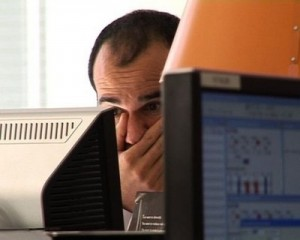

Occasionally I serve up a post on my investing successes. Now let me tell you about the worst trade I ever made and the lessons I learned. On January 3, 2008, on the post [My Drudge Report Oil Short Investment Tip](/2008/01/my-drudge-report-oil-short-investment-tip/), I wrote:

> Ive noticed over the past few years that whenever a barrel of oil hits a new price threshold that the DrudgeReport will put out a big red banner or siren announcing it. And then something happens almost without fail in the following two weeks. The price drops. After seeing this pattern play out over and over, I decided to make some money on it. The last three times I saw the oil headline on Drudge, I bought shares of DCR. DCR MACROSHARES OIL DOWN is an ETF that makes money as oil falls in price. I set a goal of 5-10% gains with a 2 week holding limit. As soon at it hits, I sell the shares. I try to avoid buying on a Friday as bad things that can spike oil often happen over the weekend.

Last December as oil was going higher and higher, I went on record saying the [price would collapse](/2008/11/oil-hits-55/) by the end of the year. Deflation smacks commodities the hardest. What I never saw coming was the spike toward $150 a barrel. And the people at Macroshares never saw it either. Their leveraged ETF was not designed to handle spikes that high and the ETF stopped trading as the price approached $0.00.  What did I do wrong?

1.  Going into the close on a FRIDAY, I already had a 10% gain. My own rules which I spelled out back in January, stated to close out the position after a 5-10% gain. It also warned of holding this ETF over the weekend as _**bad things that can spike oil often happen over the weekend.**_
2.  Over the weekend, bad things did happen to the price of oil and my $1500 gain quickly turned into a few thousand dollar loss. Instead of taking my lumps, I decided to hold the position. My swing trade became a long term investment just as oil was spiking. I was get hammered and I held.
3.  There was trouble over at MACROSHARES. I was too busy watching the price of oil. I had blind trust in the ETF. A press release was put out stating the ETF was going to close. I read it 3 weeks after it came out.

So I ended up selling for a $9,000 loss. Had I held until the ETF closed shop, I would have lost $16,000. Now that oil is falling like rock, it is a little ironic knowing that had MACROSHARES not bungled the ETF and had I slipped into a coma and woke up today, my investment would be up over $50 grand. What are the lessons I learned?

1.  Don't get greedy in the heat of battle. Emotion will try to overrule logic when the gains and losses are high or come on suddenly.
2.  Avoid holding leveraged ETFs over the weekend, especially if you already have a gain that you can easily lock in.
3.  Don't have blind trust that the company offering the ETF knows what they are doing. Do spot checks for news stories or blogs being critical of their performance relative to the indexes they claim to match. Look for _slippage_.
4.  Take the small loss earlier. Buy and hold is for suckers. This is especially true for leveraged index ETFs. Unless you are confident the ticker is going up, get out. You can always buy it back later. Paying two commissions would have saved me thousands.

The biggest lesson I've learned from investing, which I must give credit to [Nassim Nicholas Taleb](/2008/06/meet-nassim-nicholas-taleb/), is awareness that **it is human nature to credit our successes to our skills and our failures to luck**. I lost $9,000 not because hedge funds started speculating in oil, Middle East tension or even that Macroshares was incompetent (which they were). I lost $9,000 because I was wrong.

---

## Comments

### dhammy
*December 8 at 2008 at 4:20 PM*

Mas,

I've had some very similar experiences and lost big dollars over the last couple of years.  Keep emotion out of it and take those lumps early is too true.

The last two blog posts are great stuff, by the way.

D

---

### TigerAl
*December 8 at 2008 at 5:31 PM*

I have been reading this book and the author really does a good job of covering the psychological aspects of trading: https://www.amazon.com/Trading-Living-Psychology-Tactics-Management/dp/[phone removed]/ref=pd_bbs_sr_1?ie=UTF8&s=books&qid=[phone removed]&sr=8-1

---

### Jenn
*December 8 at 2008 at 8:17 PM*

don't you hate it when you don't follow your own advice :-)

---

### Geldpress
*December 10 at 2008 at 2:50 PM*

Nice writing, as always!

Can you be more specific on the macroshares trouble?  What did they do wrong?  Do you still have a link to the article you can share?

---

### MAS
*December 10 at 2008 at 2:53 PM*

I didn't think the gritty details would be of interest.  Forgot that the Geldpress was reading.  :)

http://www.etfguide.com/news/319/Two-Oil-ETFs-Closing-%E2%80%93-Clearing-Up-The-Fog!/

"As the Up-MacroShares trust increased in value, the Down-MacroShares Trust decreased in value by the same dollar amount. The reference price of oil at inception was $60. When this threshold surpassed $111 it meant 85% of the Down Trust’s (DCR) assets were pledged to the Up Trust (UCR). When the reference price of oil closed at $111 for three consecutive business days, early termination event was triggered.

UCR and DCR were issued with an original base value of $60. A 185% price movement in either direction would result in the above termination trigger. "

---

### Geldpress
*December 10 at 2008 at 3:10 PM*

Thanks for the link.  Macroshares does do something unique in pairing their inverse and long ETF's together, but I don't quite understand it - YET.

---

