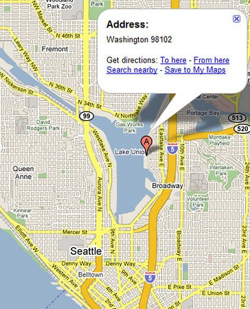
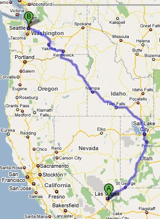

I solved a mystery this week that has been puzzling me for a while. Before heading outside, I would jump onto Google and type "weather 98109". 98109 is the zip code for the Queen Anne neighborhood of Seattle. As the temperatures started dropping in Seattle, I noticed Google was returning higher temperatures than the other weather sites. At one point a few weeks ago, it was 45 F in my neighborhood, yet Google was saying it was 72 F. In order to get accurate weather, I started entering the Lake Union zip code (98102), which connects to the East.   Then I accidentally entered my zip code of 98109 and clicked the Map link and what do I see? Las Vegas. All the surrounding zip codes work fine. I discovered a bug with Google.   These two zip codes touch each other, yet Google thinks they are many miles apart.  I've reported bugs to Google in the past regarding [Blogger](/2008/02/death-to-blogger/) and never received a single reply. If I were a business owner in the 98109 zip code, I'd report this immediately. You are probably losing business due to this bug.  UPDATE (4/5/2009): Google FINALLY fixes this bug. Details in [Leaving Las Vegas - Google Returns Queen Anne to Seattle](/2009/04/leaving-las-vegas-google-returns-queen-anne-to-seattle/).