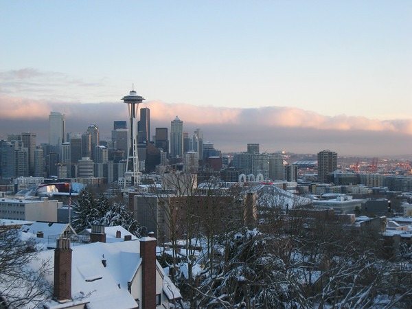
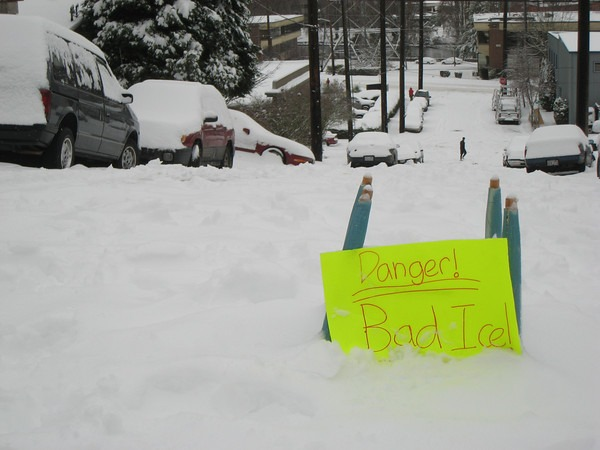

I just finished emptying my camera of more Seattle snow photos. I've hiked almost 50 miles around Seattle since the snow began. This is my idea of taking a week off from lifting weights.    Look at the above photo. That is my street! YouTube is being flooded with videos of people skiing, sledding, snowboarding and tubing down my hill. User [caseyengler81](http://www.youtube.com/user/caseyengler81) made four short videos of people heading down Queen Anne Ave (aka The Counterbalance). A block over, I made a 9 second video of someone attempting to sled down from the top of Kerry Park: [Sledding Down Kerry Park in Seattle](http://youtu.be/MYVKYlTJTgw).