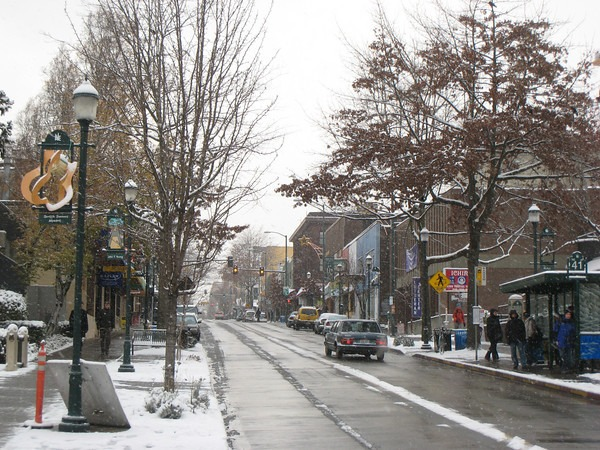
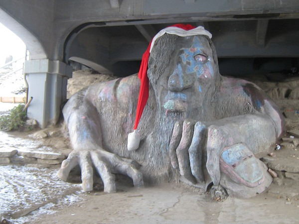
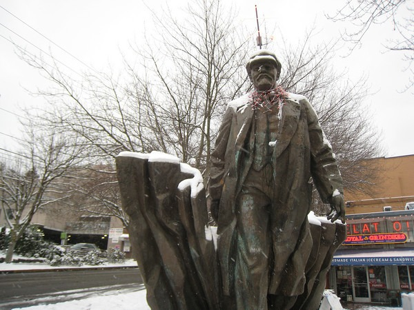

When I woke up this morning, I had no idea that I was going to do an urban hike. I looked out the window and the snow was pouring down. Oh yeah! There would be no stock trading today. It was time to play. Armed with a digital camera, 2 bottles of water and a Vicodin, I left home around 9 AM. I tried to make a snow man at Kerry Park, but the snow wasn't packing. See the little guy? You might have to squint to see the Space Needle.   From there I headed downtown to Pike Place Market.  A skier passed me in Pioneer Square.  Then it was off to the International District. That is when the snow came down the hardest.  From there I doubled back a little and then went to Capitol Hill. On some side street I met a couple that had just finished their snow man, so I posed for a photo.  Once in Capitol Hill I had to make a choice. Either head back home or go for a long hike, which meant heading to the University District. I chose the long hike.  From there I cut over to Wallingford and then to Fremont. I had to visit The Troll and throw a snowball at Lenin. :)   At this point, I walked around Fremont before heading back to Queen Anne. On President's Day I did a 14.55 mile [urban hike of Seattle](/2008/02/urban-hike-seattle/). Despite the snow and cold temperatures, I topped it with a [16.22 mile](http://www.gmap-pedometer.com/?r=2444384 ) hike.  [Photo Gallery for Seattle Urban Hike - Snow Edition](https://www.flickr.com/photos/129592470@N02/sets/72157650129133041/)