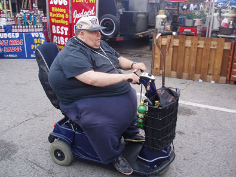

Earlier this week I got some good natured ribbing from friends about the fact that I'm testing non-mainstream fitness and nutritional ideas on myself. I've become a one man experiment in my quest to better understand a few concepts in evolutionary fitness.

Modern society is fatter and weaker than our evolutionary ancestors. Our lives may be safer, but we traded that safety for obesity and cancer. Can we improve our fitness by better understanding history?

The three main concepts I am looking into are:

1.  Primal fitness favored the strong, the fast and those with endurance. The hunter gather needed to be strong enough for the hunt, fast enough to escape prey and have enough endurance to walk far distances to gather more food. The movement toward food sources was not rigid. It was dynamic and unpredictable.
2.  For 99.99% of human evolution, we did not exist in a perfect temperature environment. We got hot and we got cold and our bodies learned how to deal with it. We now go from temperature controlled homes to temperature controlled cars to temperature controlled offices.
3.  Primal man was not able to eat 3 square or 6 small meals each day. Food came and went. When the food was plentiful, it was consumed. When it went away, the hunting and gathering resumed. Primal man didn't need to eat a _Cliff Bar,_ because his blood sugar was falling. He survived. He was larger and more muscular than his agricultural descendants. And those that survived childhood and prey, lived almost as long as modern man. The only difference is they weren't diabetic and obese taking copious amounts of medication while riding a Rascal.

_How would this man have survived in a primal world?_

How am I testing these ideas?

1.  For years now I've already been in the evolutionary fitness camp. I just didn't know it. Low-rep compound weight training, hiking and playing games like basketball.
2.  In the post [No Jacket Required](/2008/12/no-jacket-required/), I go into greater detail on how I'm training my body to handle cold weather by not wearing a coat in the winter. Temperatures have dropped to the 30s in Seattle and I'm still wearing a short-sleeved shirt. It is getting easier.
3.  Caloric timing is something I'm not ready to discuss yet. Me and a friend of mine are testing out a hybrid primal/modern eating strategy right now. It is somewhat contrarian in nature, which appeals to the investor in me. The testing is only two months old, so I'm not ready to call this _The Holy Grail of Fat Loss_ ...yet. By spring, I will discuss this test in great detail.

---

## Comments

### Jim
*January 19 at 2009 at 4:06 AM*

I think it is the three levels of power that affects this most ...physical, economic and intellectual.  For most of evolution physical power ruled ...but then economic power trumped it ...finally knowledge trumped that.  

It is to a point that physical power is no longer necessary for survival ...and economic power is better rewarded at this point in history (i.e. financial security, attractive mate, big screen TV, etc.).

Here is a recent article on evolutionary effects I found fascinating (from The Economist) :
http://www.economist.com/node/12795581

---

### Kristian
*January 19 at 2009 at 4:23 AM*

You make a basic assumption above that humans were fitter in the stone age below. That makes sense. But weren't they also shorter (because they didn't eat as well - to your point #3), and had much shorter life spans (probably also partially caused by your point #3, but perhaps also by your point #2).
Perhaps people aren't as fit today as they were in the stone age, but as I understand things, people live about twice as long today and are veritable giants compared to people (with pretty much the same DNA) in the stone age.

---

### MAS
*January 19 at 2009 at 5:26 AM*

Jim - 
Thanks for the link.  Love the Economist.  

K -
Measurments of early Paleo skeletons have the average male height at 5'11.  By 3000 BC (5000 years into agriculture), that average dropped to 5'3.  Late male hunter gathers near Greece averaged 5'9.   It is only in very recent history that our size has returned.  Is that due to following our instincts or massive amount of calories and a food supply full of growth hormones?  

-- Source Jared Diamond Discover 1987

---

### Kristian
*January 19 at 2009 at 5:31 AM*

Really interesting that people were taller 3000BC and only shrunk after that. I had no idea. I wonder if there are any stats on the average life span in 3000 BC.

---

### MAS
*January 19 at 2009 at 5:40 AM*

The book I'm read lists average life expectancy at 26 years for hunter-gathers, but that it dropped to 19 with agriculture.  

Many deaths were do to infectious disease and childbirth.  If you could survive childhood and disease, life expectancy was close to modern society standards.  

-- Source Waistland by D. Barrett

---

### Kristian
*January 19 at 2009 at 6:14 AM*

Wikipedia's https://en.wikipedia.org/wiki/Life_expectancy#cite_note-kaplan-0) info on life expectancy throughout history seems well researched judging from the references. It lists the life expectancy in the Upper Paleolithic (40,000-10,000 years ago) as 33, and as 39 for those who reached the age of 15.
Then it looks like the life expectancy went down to 20 and 18 during the neolithic and bronze ages (40,000-3,200 years ago). No info on life expectancy for those who survived birth + early childhood there, but if the impact of that early death is similar as that before, perhaps the life expectancy for those who survived until 15 during those times would be around 25-30?
Does "Waistland" really say that life expectancy 3000BC was close to today's numbers (50-80 for any developed country)?

I believe you have a point with #1 above (that unpredictable movement in all kinds of ways at different times is the best way to build a healthy fit body). And I'm sure training for #2 (tolerating changes in temperature better) makes you better at dealing with temperature changes. I've seen how people get used to dealing with heat or cold as they move from one place to another.
But I'm not convinced #2 (tolerating changes in temperature better) or #3 (eating less regularly and predictably) will improve health, life expectancy or happiness.

---

### MAS
*January 19 at 2009 at 2:06 PM*

Waistland didn't city a number in that passage, but I believe the point was they found skeletons from that era that lived as long as modern man.  They avoided disease, trauma and prey.  

#3 is something I'm still researching, experimenting with and tweaking.  I'm not ready to discuss, defend or endorse anything at this time.

---

### MAS
*January 19 at 2009 at 2:39 PM*

On #3, I'm just opening a dialog at this point.  However, I now realize I did a poor job explaining myself on that point.  I'll do another post later this week that I hope makes my thoughts more clear.

---

### Paul
*January 19 at 2009 at 4:20 PM*

Hi MAS,

Concerning point #2 humans have always sought a more balanced temperature environment. Tanning hides and wearing furs. Going without a coat is counter to human development. Our superior use of tools derived from two main functions, catching prey and making shelter / clothing. Even the Ice man of the Alps was wearing a heavy coat stuffed with straw to hold in warmth. You might have been more on the mark but opening your windows in your apartment year round. 

Also something to take into account concerning the foodstuff available to Paleolithic people, their dentition was very different from ours. They had stronger jaw muscles and thicker enamel on their teeth to enable them to chew foodstuffs that we would find difficult.  The evolutionary process recognized the lesser need for heavy dentition and has been slowly moving towards a slimmer jawline, by removing the need for the wisdom tooth, in fact some people don't have any or only 2 of the 4. If you look at a paleolithic skeleton there is a pronounced ridge along the center of the skull where the jaw muscles connected. As well as a thicker jaw and heavier bone growth along the bottom of the skull around the hinge of the jaw

Concerning the average height of paleolithic people, archaeology has found that the colder the climate, including times of increased glaciation people adapted by having shorter limbs and denser bodies overall. Whereas in equatorial regions people were more likely to have thin bodies and more surface area to more efficiently radiate heat. So if there was an ice age people tended to be shorter and thicker and if there was a warm up the trend reversed. So given all that someone of your somatype should probably move back to Florida :-D

Good stuff overall Look forward to reading more

~Paul

---

### MAS
*January 19 at 2009 at 5:28 PM*

Paul - good info.

Regarding #2 - <a href="https://criticalmas.org/2008/12/no-jacket-required/" rel="nofollow">De Vany believes</a> that teaching the body to deal with minor stresses such as temperature, better prepares the body to deal with major stresses such as stroke and heart attack later in life.  There is also the case of developing BAT as a response to dealing with cold temps.  So the possibility of living longer and leaner with cold weather temps exists.  Worst case scenario is one spends less on sweaters and coats. :)

As far as life expectancy and height, I think my intent got drifted in the comments.  I'm really only concerned with what I can adapt to my life.  My life expectancy and height are genetics mostly.  My quest to be leaner and muscular however is something I hope I can learn about from history.  We will see.

---

### leon
*October 18 at 2010 at 3:00 PM*

Check out this page for the estimated age and size of people thru the history of mankind.
They didn't live that awefully long and size wasn't that big either. 

http://www.beyondveg.com/nicholson-w/angel-1984/angel-1984-1a.shtml

---

### MAS
*October 18 at 2010 at 3:45 PM*

@Leon - The chart you linked to shows paleo man was taller than modern man and that when agriculture was introduced avg height dropped by 10 centimeters (males).  

As for life expectancy, once you correct for deaths at birth and childhood, paleo man - despite having a much harder life - could be expected to live much longer than 39 years.  

http://donmatesz.blogspot.jp/2010/02/paleo-life-expectancy.html

---

