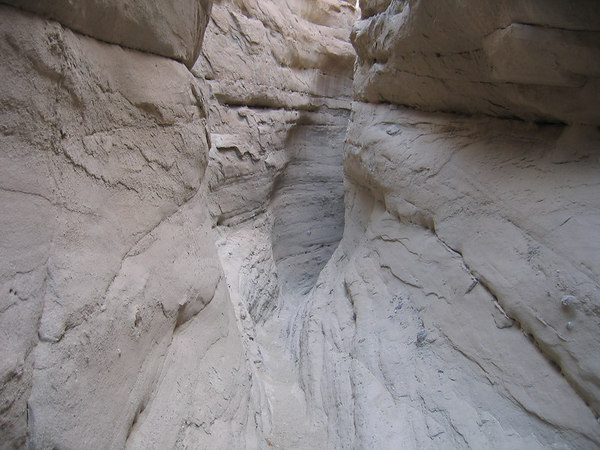
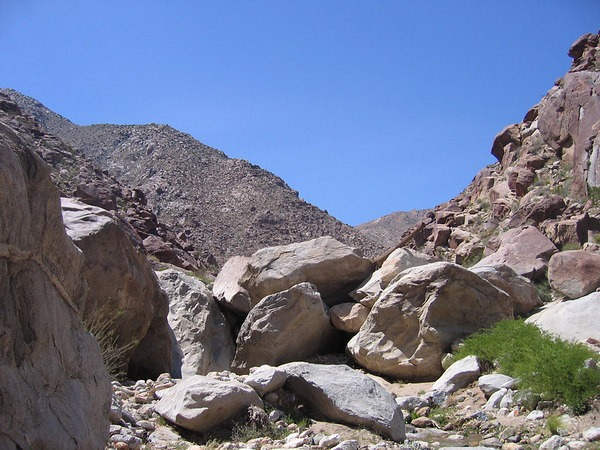

Yesterday the weather was perfect, so I decided to go on a regular hike. Not an [urban hike](/2008/12/urban-hike-seattle-snow-edition/), but return to an actual trail. Seattle has great hiking, just ask anyone that lives here. They can't stop telling you how wonderful the hiking is. There are numerous trails that will guide you to the top of some mountain underneath an evergreen canopy. What can I say about the views? How about this: they pretty much look the same. _Oh no he didn't!_ Yes I did. I've been spoiled on San Diego hiking. Seattle hiking bores me. I enjoy the workout and getting away from the city, but I miss the diversity and views I had hiking in San Diego. **I want a view as the hike progresses, not just at the summit.** My favorite type of hikes in San Diego are the desert and slot canyon hiking, which are perfect this time of year.  _Calcite Mine Slot Canyon Hiking in San Diego_  _Boulder Hopping in Borrego_  _Canyon Sin Nombre_  _Part of the Pacfic Crest Trail along the Laguna Mountains_ Now before I get the wrath of Seattle hikers, let me say that I don't want to hear about some hike in Eastern Washington, Canada or on the backside of the Olympic Peninsula. That isn't Seattle. Every hike listed above is in San Diego County. I could easily list another 50 and each one looks different from the rest. When I lived in San Diego, I was able to leave my home after rush hour, complete the hike and be back well before sunset and usually before evening rush hour. The drive out to the hike was scenic, enjoyable and not littered with the speed traps commonly found on Seattle's I-90 corridor. Seattle hiking is better than most of the country. It just isn't better than San Diego. Now when it comes to Urban Hiking, Seattle is the best.

---

## Comments

### Jenn,
*February 9 at 2009 at 4:04 AM*

we've got some nice hiking here in New Mexico too...  and the weather's starting to warm up again.  We should be good for another 4 months 'til the heat comes.

---

