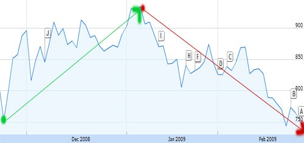

From Christmas through the New Years, I told several people who stayed fully invested in the stock market that they received a holiday gift. That gift was the _Santa Claus Rally_. It was a wonderful chance to exit long positions and minimize the damage caused in October and November. The _Santa Claus Rally_ as defined by the [Investopedia](http://www.investopedia.com/terms/s/santaclauseffect.asp):

> A surge in the price of stocks that often occurs in the week between Christmas and New Year's Day. There are numerous explanations for the Santa Claus Rally phenomenon, including tax considerations, happiness around Wall Street, people investing their Christmas bonuses and the fact that the pessimists are usually on vacation this week.

The _Santa Claus Rally_ was not the foundation for the next bull market. It was your opportunity to get out of the stock market and move your money into [fixed income](/2008/07/hope-your-401k-is-in-fixed-income/). Sadly, the same people who ignored my advice back in July to get out of the stock market ignored my advice again. That 25% pop Santa gave you is all gone. Now the market is reaching new lows.  _S & P 500 chart from the November 2008 lows to the closing lows of February 2009_ The takeaway lesson from 2008 should have been to understand and respect RISK. However, I am now seeing people who lost a lot of money in the market taking a Vegas-like _double-down_ attitude. The reason you invest in stocks is because you believe they will rise in value, not because you are down and need to reach for yield to make your retirement goals. Rallies can and do occur in bear markets. That doesn't mean it is safe to get back in the pool. Look at the chart below if you want to see how easily an investor can be head-faked into thinking a bottom has formed. 

---

## Comments

### Steve
*February 28 at 2009 at 9:04 PM*

History can be a GREAT teacher, but, we must wish to be taught.

---

