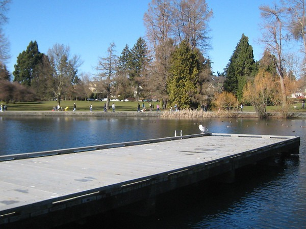

It was one year ago that I did my first [urban hike of Seattle](/2008/02/urban-hike-seattle/). Why not turn _Presidents Day_ into an _Annual Urban Hike Seattle_ day? The weather was sunny and clear. Temperatures were in the low 40s with some wind. I almost put a jacket over my short-sleeved shirt, but [you know me](/2008/12/no-jacket-required/). Partially because I wanted to cover more distance and partially because my fingers were numb from the cold, I decided to take less photos.  _From the Ballard Bridge_  _Greenlake_  _Downtown Seattle_ Total distance covered today was [22.5 miles](http://www.gmap-pedometer.com/?r=2566165 ). 

---

## Comments

### Kelli
*February 17 at 2009 at 3:33 PM*

If I didn't know better, I'd think you were training for another marathon.

---

### MAS
*February 17 at 2009 at 3:49 PM*

Instead of Powerade stations, I stop frequently for espresso breaks!

---

