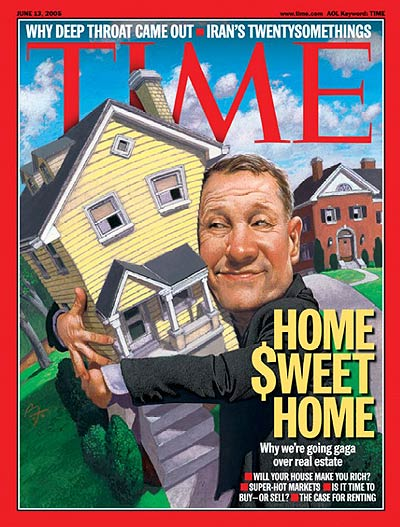

Catchy title, eh? I exaggerate, but there definitely is an undercurrent of hostility between different parties in the housing crisis. When I posted [Mr. Microsoft vs Seattle Billy](/2009/02/mr-microsoft-vs-seattle-billy/), the comments exploded. Some of the commenters were justifiably irate with _Mr. Microsoft_ for deciding to walk away from his mortgage.

Then President Obama announced his mortgage plan and the anger level went up.

Whether or not this plan directly helps irresponsible home buyers is being debated all over the Internet. However, the perception is money will be taken from responsible tax payers and given to the irresponsible. Yesterday on CNBC, Rick Santelli went on a rant. Santelli is not a typical CNBC talking head. He is by far the smartest and most honest guy on the network. Rick Santelli is an outstanding journalist and the closest thing that network has to a _Regular Joe_.

Some quotes from the [Santelli Tax Revolt Rant](https://www.youtube.com/watch?v=zp-Jw-5Kx8k):

> The government is promoting bad behavior!

> This is America! How many of you people want to pay for your neighbor's mortgage that has an extra bathroom and can't pay their bills?

Rick Santelli even went as far to declare he would be organizing a _Tea Party in Chicago_. I read a few finance and investing web sites and there is a lot of support for this type of event. Someone has already started a blog to monitor [The Chicago Tea Party](http://chicagoteaparty.blogspot.com/).

So far the battle is between those that pay their mortgage and those that aren't. But, there is a third group that should also be outraged. **Those people who decided NOT to buy a home during the bubble should be livid.** For years they were told they were missing out. Our society was drunk on rising home values. The renters that decided to be prudent were taunted. Look at this June 2005 cover from Time Magazine.

Why should they be livid now? Well for years they paid higher rents as rental property was being converted to homes for sale. Often this group had to keep moving while a higher percentage of their income was directed at housing. Now these people will be taxed to pay for those bought homes that they couldn't pay for. In other words, they will have to give their neighbor another housewarming gift.

It gets worse. Treasury, The Federal Reserve and politicians are now doing everything they can to stabilize home prices. Stable home prices are good if you already have a home and see that home as an investment vehicle. **If you are in the market for a home, affordability is what you desire.** Wonder why John McCain is so adamant about propping up home prices? Could it be he is having [trouble selling his house](https://web.archive.org/web/20140329180424/http://blogs.phoenixnewtimes.com/valleyfever/2009/02/john_mccains_former_residence.php)?

The end game is homes values will return to 3x income. Down payments will be closer to 20%. Housing inventory will eventually drop to historical averages of ~6 months. Unfortunately, this process is going to take years to play out.

---

## Comments

### dhammy
*February 20 at 2009 at 7:18 PM*

In my mind I'm comparing this aspect of the bailout plan to the original Bush-backed bailout.  It makes you wonder, is it better to dump money into the big banks/AIG/Citigroup, etc.  Or is it better to help out our either unlucky and/or stupid neighbors who bought these unscrupulous mortgages for inflated properties.  In the first case it feels like we're bailing out the drug dealers.  In the latter we're helping out the addicts...

---

### MAS
*February 20 at 2009 at 7:20 PM*

Great analogy!

---

### Ed
*February 21 at 2009 at 5:56 PM*

re:  "The end game is homes values will return to 3x income.  Down payments will be closer to 20%.  Housing inventory will eventually drop to historical averages of ~6 months.  Unfortunately, this process is going to take years to play out.".

The end game is when the Dollar collapses and banks have become nationalized. What this means is that once the Dollar collapses then homes will become property of the government too, among other things. 

Years?

---

### MAS
*February 21 at 2009 at 6:50 PM*

Ed - I know you are a fan of precious metals.  What percent of your portfolio is in gold, silver and the miners?  Physical vs ETF?

---

### Ed
*February 21 at 2009 at 11:53 PM*

Hi MAS,

Sorry, no comment. I wish it was more. Why do you ask? Are your palms getting sweaty?

---

### Matt
*February 23 at 2009 at 8:34 PM*

Ed - I really respect you and your comments. So, this is no slap at you at all and I hope you don't take it that way (I agree with probably about 90% of all your posts).

However ...

All real estate is already owned by the government. This is something that a lot of people don't really understand. After all, 'Real' means 'royal'. We are all paying lease payments on our properties we think we 'own' (it's called taxes). And the government controls what we do with our properties (called zoning). Fortunately, however, in the US, we are governed by English Common Law versus Spanish Colonial Law so government seizure is far less likely as long as you keep paying your taxes and following the zoning (and other laws) as closely as possible. Under the Spanish Colonial Law system, the government can pretty much do whatever the heck they want (ask anyone who has owned property in Fiji over the last decade for example). And, the US government WANTS as much private residential property 'ownership' as possible because, as it is with most things, they suck at managing property and have admitted it (just go by about any public housing project and you'll see what I'm talking about). But they need that revenue base so the best way to maintain and  grow it is via private 'ownership' (why the "American Dream" concept was started).

So, I'd rather live in this system than what we've had in the past (feudal) or what other societies currently have. And, I don't think that's being threatened right now with any of the packages that will end up passing due to the points I've illustrated above.

But, what do I know.

Matt

---

### Ed
*February 24 at 2009 at 3:49 AM*

Hi Matt,

The world economy is being unglued at the seems. As it stands now, its only a matter of time before the Dollar collapses. Obama's stimulus deal is one of the last ditch efforts to correct the problem. If this doesn't work then they'll have to sieze pensions and whatever else like what happened in Argentina a few years back.

re: "Fortunately, however, in the US, we are governed by English Common Law versus Spanish Colonial Law so government seizure is far less likely as long as you keep paying your taxes and following the zoning (and other laws) as closely as possible".

Once the Dollar collapses the rules change drastically. No more Bill of Rights, Constitution will exist. This is because Capitalism will have run its course and failed and there is no more reason for global leaders to implement a democratic form of government for the good of the people in a new global order. There's not enough resources to go around. Paying ones taxes will be trivial at this point, you won't have anything to pay them with. All assets whatsoever will be siezed pronto. No questions asked.  

re:"So, I’d rather live in this system than what we’ve had in the past (feudal) or what other societies currently have. And, I don’t think that’s being threatened right now with any of the packages that will end up passing due to the points I’ve illustrated above".

Enjoy it while you can Matt, the past feudal systems people have lived under will be pale in comparison to the communistic tyrannical juggernaut about to be unleashed. 

I think its best to heed the warning of the prverbalist the best we can written over three thousand years ago.

"Shrewd is the one that sees the calamity and proceeds to conceal himself, but the inexperienced have passed along and must suffer the penalty"

Maybe I've been reading to much conspiracy theory?

But more importantly, "Dirty Harry" is on in 7 minutes on AMC channel. Got to go.

---

