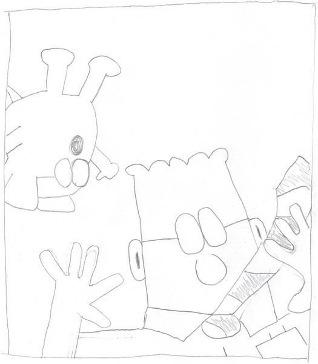
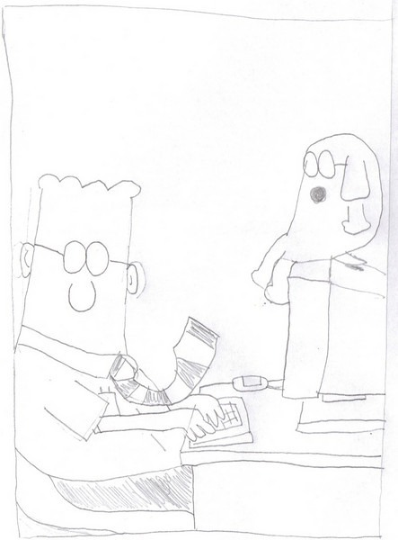

This weekend I was taught a drawing trick. Turn the image upside down and then attempt to draw focusing on spacing and not the actual object.

From ArtInstructionBlog.com - Learn How To Draw - Top 20 Drawing Tips For Beginners (#20):

> Drawing upside down is a wonderful exercise to awaken the right side of your brain. When you turn an image upside down, you are making it somewhat abstract and unrecognizable. This forces you to draw what you see as opposed to relying on your memory to draw something.

Here are my first two attempts using Dilbert.

---

## Comments

### TigerAl
*March 10 at 2009 at 1:01 AM*

Wow, looks pretty good, I might just try it (though a "before" and "after" with the technique may have been useful to fully assess the impact :) )

---

### Jim
*March 10 at 2009 at 4:06 AM*

Ok, maybe off-topic, but this may be the funniest Dilbert ever, so I thought I would share...

http://ritholtz.com/2009/02/bailout-hearings/

---

### MAS
*March 10 at 2009 at 4:24 AM*

I love Dilbert.  Great find.

---

