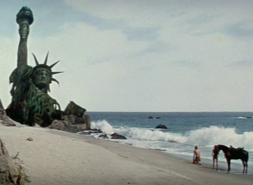

When I heard The Federal Reserve was going buy Treasuries (aka [Quantitative Easing](http://polizeros.com/2009/03/18/quantitative-easing-or-why-i-dont-think-its-as-rosy-a-picture-as-bernanke-paints/)), I couldn't help think of the final scene in [The Planet of the Apes](https://en.wikipedia.org/wiki/Planet_of_the_Apes_\(1968_film\)).

> You maniacs! You blew it up! God damn you! God damn you all to hell!

 Over on [TickerForum.org](http://tickerforum.org/akcs-www), someone asked how to explain _Quantitative Easing_ to the average American. User _Mayorquimby_ said this:

> Imagine you owe $20K on your credit card. Your interest is $500 a month. You can barely pay the interest. So you issue YOUR OWN credit card and LEND YOURSELF more money to pay your bills. And you expect your credit card company to INCREASE your line of credit (which is always MAXED) when the know full well that you're paying them with money borrowed against yourself!!!!

Now imagine you are a country, not an individual. And instead of relying on your own population to buy that debt, you rely on foreign governments. Put yourself in the shoes of that foreign government that trusted us enough to park their savings into T-Bills. What happens next?

---

## Comments

### Jim
*March 19 at 2009 at 5:17 AM*

As long as the rate on your credit card is between 0 and 25bps it's really not a big deal.  It's when the economy rebounds and you have to raise the rate to 5% or 10% to stop inflation ...THEN you have a problem.  

There are only three possible outcomes:
- If you print more money to pay the interest it is hyperinflationary.  Since the US$ is the world reserve currency it could create hyperinflation throughout the entire world.
- If you raise taxes too high it will reduce consumption and potentially launch a new slowdown.
- If you default on all the debt then the solvency of the US government is in question ...not to mention the potential for war.

This is the potential hyperinflationary scenario I've been going on about, but nobody believes me yet ...except the "gold bugs" who have been predicting hyperinflation since we went of the gold standard in the 1970s (kinda early).

Interestingly, I guess when China asked last week if their $2 trillion in "loans" were safe or not Bernanke responded almost immediately by diluting their value!  The US dollar lost 2% in value immediately after the Fed announcement!  I guess China lost $40 billion this afternoon alone.   Welcome to capitalism boys!

---

### MAS
*March 19 at 2009 at 1:05 PM*

England is doing it.  Now Canada is hinting it will to.  Is Europe next?  Is this a coordinated effort to have all the debts of the Western countries dumped on the backs of the Asian (saver) countries?  

I don't see this ending well.  

Jim Rogers did make a good case for buying a commodities ETF.  People still need to eat.

---

### MAS
*March 19 at 2009 at 2:54 PM*

Yeah commodities are something I really don't understand and would have to research more before investing in that market.

---

### Jim
*March 19 at 2009 at 3:05 PM*

Rogers said:  People still need to eat.
NAR said:  People will always need to live somewhere.

Be careful of statements like this.  Price is a function of supply and demand ...statements like this don't really address either.  I read somewhere during the GD farmers couldn't sell their crops ...people were starving, but had no money to buy them.

To your larger point ...I think they are playing a very dangerous game with taxpayer money.  They have allowed "too big to fail" companies to take the US hostage.  The taxpayer is being forced to borrow trillions of dollars to pay the ransom.  

The asian countries are potentially collateral damage.  I don't actually believe that Bernanke is trying to stiff the asian countries as a primary objective ...they just happen to be in the line of fire.

---

