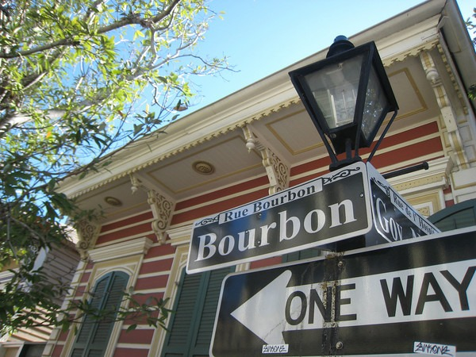
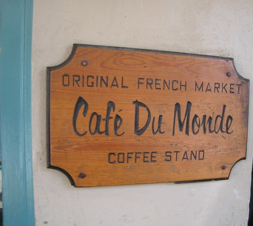
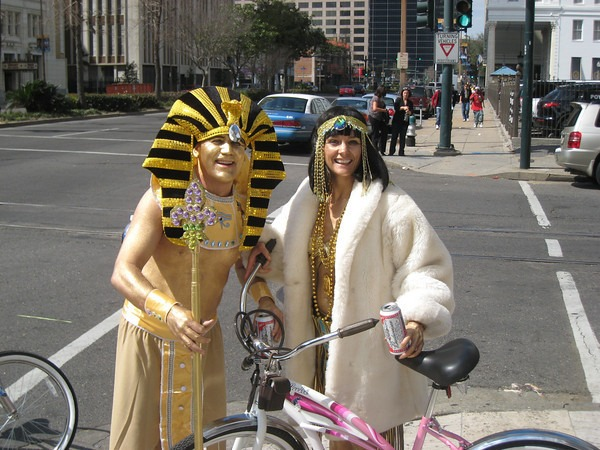
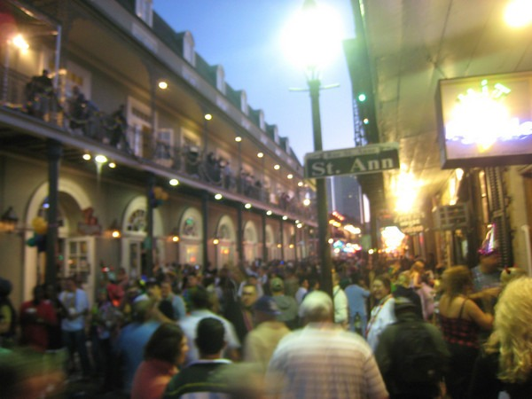

Well I am finally getting around to posting on my trip to New Orleans. I arrived on the Sunday before Fat Tuesday and left Thursday afternoon. This was a great way to see the city both during the chaos of Mardi Gras and the normalcy just afterwords.

From 1994-1998, I lived in the Tampa Bay area and I spent a lot of time in Ybor City. Ybor City is the Cuban version of The French Quarter. I didn't want to spend my vacation comparing The French Quarter to Ybor City, so I took my time just soaking in the atmosphere. I did a lot of exploring and went to different restaurants and browsed numerous stores.

It was a great trip. I really enjoyed the architecture and vibe from the French Quarter. The parades were a bit too long for me (3 hours each). I made it safely down Bourbon Street during the Fat Tuesday celebration. The quiet post-Fat Tuesday portion of the trip was more my speed.

People keep asking me about Katrina. This was my first trip to Louisiana, so what I saw is all I know. I did learn the French Quarter had very little flooding. There are street signs that got bent during the hurricane that haven't yet been repaired.

Below are some highlights of my trip.

_The legendary Val Kilmer was King of the Bacchus float!_

_Bourbon Street in the morning_

_Back in college before I developed a refined (snob) taste for coffee, I would drink canned Cafe Du Monde. When I got to New Orleans I was fearful that I would no longer like this coffee. Surprisingly, after all these years, I still really enjoy this chicory based coffee. It is a very smooth full bodied cup of joe. And the Beignets were good too!_

_The Zulu Parade_

_Lots of people dress up in costumes._

_My hotel room had a nice flat screen TV and I found CNBC. Crack TV!_

_Deep Fried Pickles are the only vegetable in the French Quarter, unless you count Corn Dogs. :)_

_Bourbon Street on Fat Tuesday_

_St. Louis Cathedral_