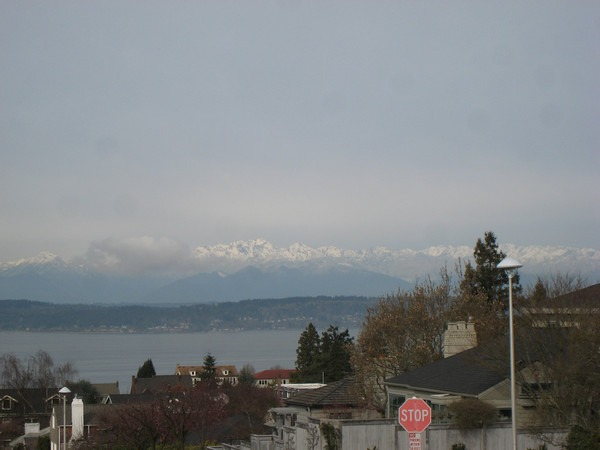
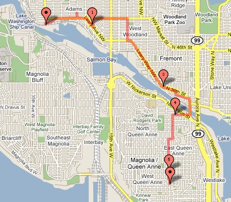

The sun came out so I did a 12 mile urban hike. This time I decided to head west and cut through Magnolia.   Then I crossed the locks and picked up the hike again.  On my way back, near the Fremont Ballard border, a woman asked for directions. She spoke almost no English. My guess is she was from Ethopia. She pointed at the address she wanted to find on a printout. Lucky for her, I happened to bring my GPS with me and was able to show her a map telling her exactly how to get to her destination. Gotta love technology.