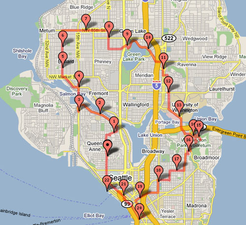

In the previous post [Intermittent Fasting - Fears and Motivations](/2009/04/intermittent-fasting-fears-and-motivations/), I mentioned that I had started experimenting with Intermittent Fasting (IF).

> In the end, I decided that I needed to know if Intermittent Fasting would work for me. Both sides of the IF debate knew more science and nutrition than me. Only my own tests would answer the question.

It has been almost 5 months and I've done 16 Intermittent Fasts. My Intermittent Fasts go between 21 and 22 hours. I average one per week. If I were obese or had a family history of cancer, I would two per week (on nonconsecutive days). During the fast, I consume no calories, unless you want to count that single [rogue calorie](https://ineedcoffee.com/black-coffee-and-espresso-not-calorie-free/) one gets from espresso. Here is how a typical IF works for me:

-   Finish eating last meal at 9 PM.
-   Go to sleep.
-   Go entire day only consuming unsweetened tea, espresso and water.
-   Break the fast with meal around 6 or 7 PM.
-   Resume normal schedule.

I had two fears with IF. Did either fear materialize?

1.  Did I lose muscle or strength? No.
2.  Did I gain fat due to a slowing metabolism? No.

By all accounts I should have gained fat this winter. For a large chunk of December I couldn't lift due to a shoulder injury. In January, my back was in serious pain. And this month I had the back injury which has sidelined me completely. Despite having my activity level plummet this winter, I got leaner. It could have been the [cold weather exposure](/2009/04/still-no-jacket-required/), the intermittent fasts or some combination.

During IF, I was able to lift weights and go on urban hikes of [12](/2009/03/urban-hike-magnolia-edition/), [15](/2008/12/another-snow-storm-another-urban-hike/), [16](/2008/12/urban-hike-seattle-snow-edition/) and even [22.5](/2009/02/urban-hike-seattle-225-mile-edition/) miles. My energy level was higher than I imagined. No _Cliff Bar_ needed.

I consider IF to be amazing success if for no other reason, I am no longer a slave to eating by the clock. If I come across poor food options, I can now choose to eat nothing. Hunger is now an acceptable feeling. Because I am now comfortable being hungry, I am longer pressured to eat fast. Taking the time to prepare a healthy meal even if it means waiting another hour is no longer a dilemma.

Something else cool happened this winter. Despite being surrounded my sick people, I never once caught a cold. That has never happened before. That could be a result of [food choices](/2009/01/fighting-sickness-ninja-style/), IF or some combination.

Some people have commented that it would be too difficult to do intermittent fasting. Trust me, I understand exactly how you feel. A year ago I never could have imagined this possible. It is doable. I do have some [tips and advice](/2009/04/intermittent-fasting-tips-and-advice/), which I will save for my next post.

---

## Comments

### Aaron
*November 8 at 2012 at 5:46 PM*

You think and plan experiments the same way I do. I plan to start fasting too. I have a question though. Is it safe to do low intensity cardio on the fasting days? I doubt it is necessary from a calorie burning stand point, but I also suspect it may be safe to do, since hunter gatherers likely were walking around for miles in between meals. Even though we know they did well, we don't know if they would have done even better some other way, or if different genes have been selected for since then.

Did you do any light cardio on fasting days?

---

### Aaron
*November 8 at 2012 at 5:49 PM*

We also know that back then the strong survived, and the weak died. Birth rates were higher, and infant mortality was higher. While IF looks good for the strong, today's adult gene pool is probably more diverse. It is possible that IF is not for everyone. I will still dabble in it and see if it is good for me.

---

### MAS
*November 8 at 2012 at 5:50 PM*

@Aaron - Yes. Most of my urban hikes which vary from 7 to 22 miles were done while fasting. 

https://criticalmas.org/best-of/urban-hiking/

I also do High Intensity Training while fasted. When I doing HIT, I make sure that I eat immediately after the workout.

---

### Aaron
*November 8 at 2012 at 5:52 PM*

You said you had some injuries. Were they greater or more frequent than before IF? Do you think the IF could have reduced your joint's repair mechanisms any?

---

### MAS
*November 8 at 2012 at 5:58 PM*

@Aaron - I suspect they are unrelated. Injuries went away once I stopped doing free weights and started using machines. This allowed me to slow down the movement safely and reduce joint stress.

---

### Steve
*September 16 at 2014 at 7:47 PM*

What does your first meal consist of when you break your 22hr fast? And about how many calories etc?

---

### MAS
*September 16 at 2014 at 8:45 PM*

@Steve - Any food is fair game after a fast. I do not count calories, so I have no idea.

---

### tom
*October 9 at 2014 at 12:59 PM*

I've also tried IF with decent results lean gains and E s E style.
I'm leaning more too a two week split routine...one 24 hour fast one week, next week 2 x 24 hour fasts.
On those fast days I will still be training weights, heavy compounds in the morning of those days.
Will that affect my strength gains bro?

---

### MAS
*October 9 at 2014 at 3:28 PM*

@Tom C - I believe so. See #2 on this post.
https://criticalmas.org/2011/10/intermittent-fasting-mistakes-ive-made/

---

### Aaron
*November 26 at 2014 at 12:37 AM*

How many leaves or berries did the hunters eat while on their hunt? I doubt enough to be filling, but if they happened by a good bush and had not found any tracks, would they not eat a few?

---

### Aaron
*November 26 at 2014 at 12:41 AM*

I heard that two big contributers to Hunter gatherer heath was that they constantly moved, avoiding disease, and they had tremendous variety in their diets.

---

### annie
*July 10 at 2015 at 4:34 PM*

I am a biochemist and yes, short term fasting lowers insulin and raises HgH. However, (and I am not against this method I am FOR this method), but I you can "tweek" this method a bit to work more in your favor. 

First off, the physicians and dieticians who scare the masses into thinking fasting is our enemy have little biochemistry or molecular biology in their coursework and most are trained in the macro science of eating and know very little about the molecular science behind eating. Here's the science you'd like to know:

The body stores less than a day's supply of glucose (glycogen). A 150 pound man stores about 900 calories of glycogen - 600 in the muscle and 300 in the liver. "The low blood sugar resulting from even an overnight fast results, through an increase in glucagon secretion, and a decrease in insulin secretion, in the mobilization of fatty acids from adipose tissue. The diminished insulin level also inhibits glucose uptake by muscle tissue. Muscles therefore switch from glucose to fatty acid metabolism for enertgy production. The brain continues to use glucose." (Biochemistry by Voet &amp; Voet 2nd ed)

What this means is: (and I apologize in advance for the bird's eye view of what's actually happening, but the molecular pathways of what's occurring are too vast for a single post)

1. Glucagon is a chemical signal that tells the body to release Human Growth Hormone, and stop producing Insulin. Glucagon increases when blood glucose (blood sugar) is low, and stops when blood glucose is high

2.  Human Growth Hormone (HgH) is a chemical that signals the body to release fatty acids from fat tissue and to increase lean tissue. HgH increases when glucagon increases, and stops in the presence of glucose and insulin.

3. Insulin is a chemical signal that tells the body to shut down the release of Glucagon, (and as a result also Human Growth hormone). Insulin increases when blood sugar is high, and decreases when blood sugar is low. 

4. Insulin is the "shuttle" by which blood sugar (glucose) enters the cells to be converted to ATP. (ATP is our energy molecule.) If more sugar enters the cells than is needed by the body, that surplus is converted to fat. IMPORTANT: Ingested fat is NEVER converted to fat. It is biochemically impossible for the body to convert fat to fat. (and that is much to complex a metabolic phenomenon than I have time to explain.) Just suffice it to say: Stored fat is made via excess glucose. Therefore anything that depletes glucose stores and creates a "starvation state" will mobilize fat stores and prevent fat accumulation.

5. Fasting increase HgH because fasting causes the liver and muscles to deplete their glycogen stores. As the glycogen stores in the muscles and liver are used up, blood sugar lowers, glucagon "wakes up" and tells the body to shut down insulin production, and therefore to start producing HgH. 

The rest of the story:

There are two other "states of being" that signal the production of HgH. Resistance training, and deep sleep. 

Resistance training damages the muscles and that "stress state" signals HgH to start repairing the damaged muscle. Sleep has a whole series of signals that also produces HgH. 

Interesting fact: The heart feeds strictly off ketone bodies which are the metabolic byproducts of fat breakdown. 

This is why 8 - 9 hours of sleep is so very important. It is the only time our bodies are given to do some serious housecleaning and home repairs. Approximately 90 minutes after you fall asleep, HgH is produced, and continues to be produced throughout the night. What this means is, throughout the night your body is breaking down fat to feed your heart muscle, (which is your hearts only fuel source) and building up the muscle you broke down and damaged by the work you put it through during the day. Sleep is one of the most important things you can do when trying to gain lean muscle. 

Here's how to tweek what you've been doing:

Stop eating at 9pm, and then going to bed. Eating that close to bedtime will all but bring any HgH you should be producing during sleep to a complete stand still, and subsequently any lean muscle you would like to be building. If you must eat that late - eat only protein, and absolutely no carbohydrate whatsoever.  You should not eat any carbohydrate at least 4 hours before bedtime. Break your fast when you awake or sometime during the day but not anywhere near your work out either.  

Bottom line: 

1. Stop eating 4 hours before bedtime. 
2. Don't eat within 2 hours before and after workout.

Additional helps if you want them:
1. Take 10 grams of L-Arginine right before bedtime. NOT before a workout.
2. 3tsps of L-leucine 3 times a day also helps break down fat and build muscle. It is one of the BCAA's but is one of the best. 
3. I, personally, would not totally fast but would drink a CARBOHYDRATE FREE home made 30g protein drink flavored with instant coffee (caffeinated or decaf) and splenda 3 times a day, then a 40 gram hydrolysate protein drink before bed. 
The reason for #3 is that during a 16 hour fast you WILL lose some muscle, not much, but you will lose some. A protein drink fast will prevent this. Anyway...hope I helped somewhat...if not...ignore me. :D
Try this...and see what happens.

---

### annie
*July 10 at 2015 at 4:35 PM*

oops - sorry for the typos in the above post. :(

---

### MAS
*July 10 at 2015 at 5:51 PM*

@annie - Thanks for sharing all the detailed info. 

For me I MUST eat before sleep or I will wake up too early in a state of hunger and not be able to return to sleep. The days when I am sleep deprived, I over eat. So although it might be optimal not to consume food for hours before bed, it is not practical for me. As for your suggestion of just eating protein - via a 40g protein drink -  I could try that, but I am skeptical that it would have the satiety effect of real food.

---

