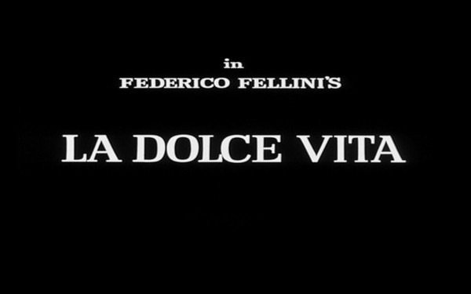
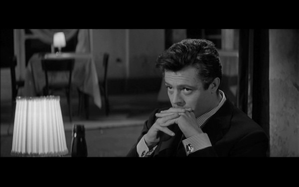
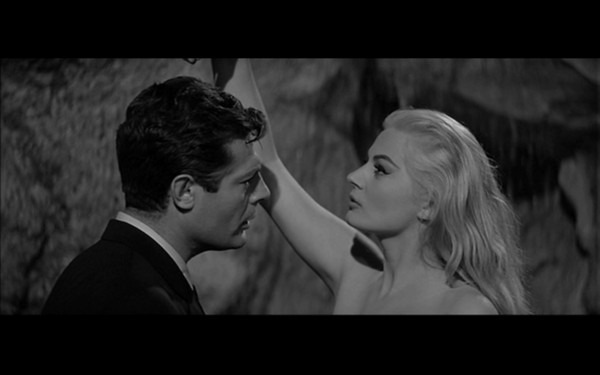

One of my favorite movies growing up wasn't well received. It was [Bright Lights Big City](http://www.allmovie.com/work/bright-lights-big-city-7127). In the movie, Michael J Fox's character descends into the New York City night life and it almost destroys his life, his relationships and his ambition.

When I first saw _La Dolce Vita_ (1960) last year, I immediately recognized it to be a much superior and sweeter film than _Bright Lights Big City_. Although they are different stories, there are some strong similarities. Both are writers that are eager to do something great, but are seduced by the nightlife. [AllMovie](http://www.allmovie.com/work/la-dolce-vita-27906) has a nice summary about the main character Marcello.

> Having left his dreary provincial existence behind, Marcello wanders through an ultra-modern, ultra-sophisticated, ultra-decadent Rome. He yearns to write seriously, but his inconsequential newspaper pieces bring in more money, and he's too lazy to argue with this setup.

Roger Ebert wrote a [great review](https://web.archive.org/web/20130531133316/http://www.ebertfest.com/nine/ladolcevita.html) of _La Dolce Vita_. He referred to the film as "a cautionary tale with a man without a center."

I recommend reading Ebert's review for a better understanding of this film. This isn't Rob Schneider, this is Fellini. _La Dolce Vita_ is a great movie.

---

## Comments

### Nick
*April 1 at 2009 at 8:33 PM*

Hmm.  I watched it, but don't remember much about it.  It clearly didn't hit me like it did you. 

Might have to re-watch it.

---

### MAS
*April 1 at 2009 at 8:36 PM*

As much as I liked La Dolce Vita, his follow-up 8 1/2 is even better.  I'll save that for another post.

---

### Mlis
*April 3 at 2009 at 12:02 AM*

Loved la Dolce Vita!  And 8 1/2!

---

