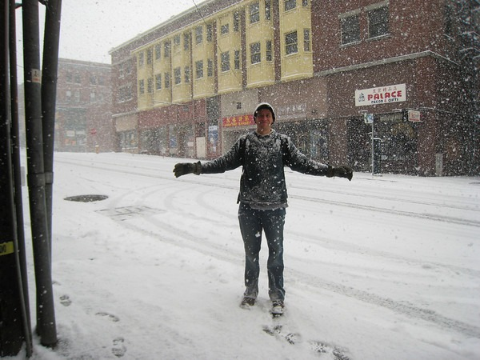

It appears that winter is over, so I'm ready to file my report on project [No Jacket Required](/2008/12/no-jacket-required/). To bring the new readers up to speed, this past winter I tested aggressive cold weather exposure on myself. From that post back in December:

> On an average day, I am now spending between 1 to 2 hours outside. As temperatures gradually dropped from summer 70s to the current mid 40s, I have remained in short-sleeved shirts. If the wind is strong, Ill add a thin fleece on top, but that has only happened once so far this season.

Other than the Seattle snowstorm, I went this entire winter wearing at most a long sleeve shirt. On most days, even those that got into the low 30s, I remained in a short sleeved shirt. What did I learn?

1.  The body is fully capable of acclimating to cold temperatures. The first few minutes are always the worst.
2.  My hands never got used to the cold and would get numb in cold weather. Wearing gloves or putting them in my pockets was essential.
3.  Movement is very important. The body does not appreciate standing still in cold weather. Even a slow walk is enough to keep warm or at the least, not be painfully cold.
4.  Respect the wind. It will chill you to the bone faster than cold temperatures. Limit exposure on windy days.

_Me during the snow storm wearing just a tee-shirt and a sweater._

Some people think I am a lunatic for trying this, but I really enjoy the freedom of knowing that I pushed my comfort zone almost 30 degrees. When I first moved up from San Diego, I would be uncomfortably cold in the low 60s. Now I head out of the house wearing a golf shirt with no fear of what the weather can throw at me. If it starts to rain, I have a rain jacket packed inside my back pack.

I didn't catch a cold or flu this entire winter. My last winter in San Diego I was sick a lot.

I didn't gain any fat this winter. That is a first. Although that is most likely from another reason, which I will save for another post.

Besides sheer will power, I had two things going for me on cold weather exposure that others might not have.

1.  Male and a higher amount of muscle - higher metabolism.
2.  I do Weight Training 2-3x a week. The result is Uncoupling Proteins throwing off heat.

I still think anyone can benefit from some cold weather exposure. It doesn't need to be as extreme as what I did. Stay out in the cold longer and wear fewer layers. You'll get used to it. You'll be fine.

---

## Comments

### Andrew
*April 6 at 2009 at 7:36 PM*

Hmm... looking at your comment about being male and having a higher amount of muscle increasing your ability to acclimate to cold weather is interesting.  Conventional wisdom would imply that heavier people are more insulated from the cold weather, but I have noticed muscular guys with low body fat often walking around with skimpy clothing.  Maybe it's not just to show off their exaggerated pecs.

Do you have any reference material about this?

---

### MAS
*April 6 at 2009 at 7:39 PM*

The first post linked at the top has an embedded video which was by the guy that introduced me to cold weather exposure.  De Vany lives in SoCal, so my tests are more extreme than this.  

Never thought about fat vs muscular.  It makes sense that fat would have an insulating effect.  Scrawny and thin would be the worst.  Just guessing.

---

### TigerAl
*April 6 at 2009 at 11:41 PM*

If you really want to do Part 2 and push the envelope on this experiment, MAS, you could try a few months without the jacket, shorts rather than jeans and, in true Seattle style, Birkenstocks with or without socks...

---

### MAS
*April 7 at 2009 at 12:10 AM*

I think I would be taken to the "nut hut" if I tried that.  :)

---

### TigerAl
*April 7 at 2009 at 12:38 AM*

Actually, I used to work with 2 guys who did dress that way in Seattle.  I think one of them was originally from Michigan :)

---

### Mike
*April 9 at 2009 at 3:21 AM*

Yes you are a lunatic for trying this... however, I just read the following which actually says that being cold activates your "good fat", which in turn burns your "bad fat":

http://www.webmd.com/diet/news/20090407/can-brown-fat-make-you-thin

Not bad...

---

### TigerAl
*April 9 at 2009 at 3:37 AM*

Bizarre that they still call it fat with the statement "As researchers looked into the mysteries of brown fat, they found that it is more closely related to muscle than to white fat".

---

### MAS
*April 9 at 2009 at 5:23 AM*

Mike D - great find!  

I'm a pioneer and didn't even know it.

---

