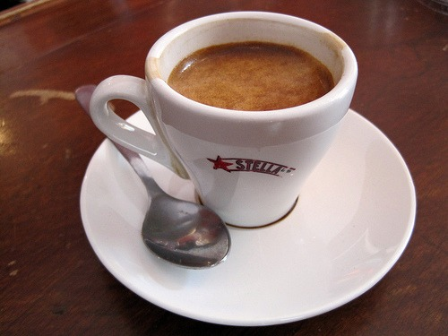

_This post was moved from Coffee Hero._ In the post [Black Coffee and Espresso - Not Calorie Free](https://ineedcoffee.com/black-coffee-and-espresso-not-calorie-free/), I discovered there are trace amounts of protein in brewed coffee, but not in espresso. According to _CalorieKing_:

-   0.0 grams protein for Espresso (1 oz)
-   0.3 grams protein for Coffee Brewed (6 oz)

The first part of the mystery is figuring out if brewed coffee really has protein. I do not have a science background, but I'll try my best to figure this out. If I make an error along the way, please let me know in the comments. The January 1995 issue of Plant Physiology has an article titled _A cDNA encoding a metallothionein I-like protein from coffee leaves (Coffea arabica)_. In this study, the authors state they found an 80 amino acid protein in a coffee plant.

> We now report the isolation of a full-length cDNA from immature coffee (Coffea arabica) leaves encoding a metallothionein I-like protein (Table I). The deduced coding region encodes an 80-amino acid protein with 64% identity to a Ricinus communis metallothionein.

This Coffea arabica protein is also found on the _WikiProteins.org_ site, where it also goes by the name _coffee metallothionein I_. This study confirms the presence of protein in the Arabica plant. Unfortunately, I couldn't find any information on the protein as it moves from the coffee plant itself to the brewed outcome. At least this study makes the presence of trace amounts of protein in coffee plausible. Now to the next question in the coffee protein mystery: Where did the protein go in the espresso? Espresso is still derived from the coffee plant. I have two theories:

1.  **Number Rounding** - The protein didn't go anywhere. The number was rounded down to a single decimal. This gave it 0.0 grams of protein.
2.  **Protein Denaturation** - The protein was destroyed due to a difference in brewing styles.

Brewed coffee has 0.3 grams of protein per 6 ounces. This works out to 0.05 grams of protein per ounce. If espresso extraction has no impact on the protein, then the 0.05 number should be rounded up to 0.1 grams. _CalorieKing_ rounded a 1.2 number to 2.0 on calories, so they wouldn't be shy about rounding a 0.05 to 0.1. So we are still missing some protein in the espresso. What if the coffee brewing differences between brewed (saturation) and espresso (pressure) caused the protein to be denatured? _TheFreeDictionary_ defines denatured as:

> 3a. To cause the tertiary structure of (a protein) to unfold, as with heat, alkali, or acid, so that some of its original properties, especially its biological activity, are diminished or eliminated.

The _Wikipedia_ page on Denaturation also mentions temperature, but not pressure. Lets tackle temperature first. According the _SCAA_, the ideal brewed coffee temperature is 200 F (93 C). Although espresso temperatures can vary by blend, I'll use the number _EspressoQuest_ charted, which is 198 F (92 C). So our temperatures are basically the same. Is it the pressure? A study titled _On the physics of pressure denaturation of proteins_ from _The Journal Of Physics: Condensed Matter_ authors Yuichi Harano and Masahiro Kinoshita write:

> A protein, a long polypeptide chain, spontaneously folds into a unique native structure in aqueous solution under physiological conditions \[1\]. However, the native structure is unfolded by various perturbations such as the addition of chemical substances, the change in the temperature or pH, and **the application of a high pressure** \[2 6\].

I located other studies that link protein denaturation and pressure. So it appears the mystery is solved. A coffee plant has protein on the root. Even after the beans go through processing, roasting, grinding and brewing temperatures, there will be a trace amount of protein left. However, if exposed to the pressure used to extract espresso, that trace amount of protein becomes denatured. Hope I got that right. If I made an error, please let me know in the comments.  _Sources:_ [Espresso, unsweetened Calories](https://web.archive.org/web/20090523083236/http://www.calorieking.com:80/foods/calories-in-coffees-espresso-unsweetened_f-Y2lkPTEwNzAmYmlkPTEmZmlkPTE1MjQwMiZwYXI9.html) - CalorieKing [Brewed Coffee, unsweetened Calories](https://web.archive.org/web/20090522064949/http://www.calorieking.com:80/foods/calories-in-coffees-brewed-percolated_f-Y2lkPTEwNzAmYmlkPTEmZmlkPTY5NTEwJmVpZD00MDgxMjcxOTImcG9zPTEmcGFyPSZrZXk9Y29mZmVl.html) - CalorieKing A cDNA encoding a metallothionein I-like protein from coffee leaves (Coffea arabica) - Plant Physiology study by S Moisyadi and J I Stiles (January 1995) Metallothionein-like protein 1 (Coffea arabica) - WikiProteins.org (page gone) [Denaturation (biochemistry)](https://en.wikipedia.org/wiki/Denaturation_\(biochemistry\)) - Wikipedia The Espresso Quest - Blog post by Instaurator (Site down January 2015) On the physics of pressure denaturation of proteins - Journal Of Physics: Condensed Matter study by Yuichi Harano and Masahiro Kinoshita (Issue 7: 22 February 2006) **Legacy Comments:** **TigerAl** \- Forgot to mention that the resolution of the measuring (in this case, weighing) device also would play a part in the error. I dont think CalorieKing cares that much about decimal point precision in calorie reporting. Your research and case was impressive though, MAS **Paul** \- What a fantastic and fascinating blog. I love coffee and discovered this via the ineedcoffee website when looking at roasting my own coffee. It has been a few years since I studied biochemistry. I could be wrong and it wouldnt be the first time. Part of what makes a protein one kind and not another is the way it folds up and looks three dimensionally. Boiling and together with high pressures will denature a protein that is to say break the bonds between certain amino acids that cause it to have the particular 3-d shape. However, chemical tests for protein would still reveal its presence.

Protein is a big molecule and perhaps crucially for your problem does not dissolve in water. Protein forms a suspension when other chemicals are present e.g. salt that is sodium chloride when dissolved in water separates forming sodium+ and chloride- these separate entities form a charged solution that interact with small charges on H2O molecule and also could form a protein suspension because certain common amino acids have either positive or negative charges. What I think occurs is because the protein is too large to be moved into the espresso cup by the time it takes to for it to form (there is high pressure but also resistance and impediance to movement by all the grind around it). perhaps if you boiled a liter of water through an espresso measure of coffee grind you may be able to sequester the protein. But when you use a French press because the coffee to be drunk is mixed directly with the grind with heat and stirring will allow protein molecules to rise. Ultimately to fall but at least present in their minuscule quantities is the drink. **MAS** - Excellent information Paul.

I never considered that option. The protein is still in the puck. I like your theory. Thanks for the comment!

---

## Comments

### Annette
*July 21 at 2013 at 10:33 AM*

Hi, I have just been diagnosed with Coeliac, (gluten free) I found your post interesting because if this is correct I could drink esspresso with no reaction to the protein as some do react to the coffee proteins in the same way as gluten proteins, see link: http://www.thehealthyhomeeconomist.com/gluten-issues-or-celiac-dont-drink-coffee/ 
I myself have reacted to coffee. Your post gave me hope! I miss my morning coffee! I just wondered if you have had any feedback on this if it is correct? Thanks

---

### MAS
*July 21 at 2013 at 1:07 PM*

@Annette - I had a similar thought when I posted this.

https://criticalmas.org/2012/03/coffee-and-gluten-say-it-isnt-so/

However, my gluten issues are not as strong as yours. For me I have not noticed an issue with coffee regardless of how it is brewed. 

I am very interested to hear your results though. I also run the INeedCoffee website and sharing what you find might be of benefit to those readers.  

https://ineedcoffee.com/

---

### Annette
*July 29 at 2013 at 6:45 PM*

Thanks for the reply, I will do a couple of experiments and let you know how I get on. We have a nesspresso machine we found it to be the best alternative to a home barista set-up which was too expensive and we just didn't have the time. I am also avoiding diary for the first few months as suggest by the GP but coffee is not the same with out it!

---

