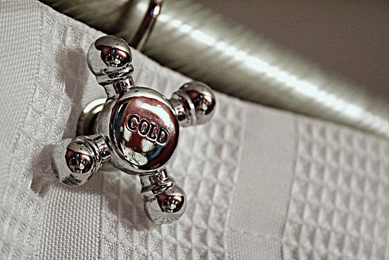

Yesterday the [media discovered brown fat](/2009/04/the-media-discovers-brown-fat/). How much of a role cold weather exposure plays in fat loss is still unknown, but there is one thing I'm confident about. This story will disappear and you most likely won't hear about it again for a very long time. It may be years before it pops up again. Why? I just don't see a profit angle in this path for fat loss, so there will be no incentive to keep the story and studies alive. How can they make a buck off the public with their findings? If Vitamin E helps reduce the risk of breast cancer, you can add that to a number of foods and remind your consumer of those studies. What can you sell to a person by telling them to take their jacket off on a cold day? Nothing yet. Some scientists will try to package a pill that activates brown adipose tissue and then sell it as a drug or supplement. That product may never come and if it does it may or may not be successful or affordable. Why wait? And why pay for a fat loss strategy that has no cost. The two issues I've heard from those that want to try this, but can't are:

1.  Busy schedule prevents them from going outside during the colder months.
2.  They live in a warm climate and are not exposed to cold temperatures.

This problem is easily solved. At the end of your shower, turn the temperature down and aim the cold water at your arms or legs for a minute or two. Before you do, take slow deep breaths. You don't want to hold your breath and have a heart attack from the shock. I also don't think you should aim the water at your chest. There is no need to start out using ice cold water. Start medium and then over time move the temperature down. As I got more comfortable doing this, I started hitting the shoulder blades with cold water as well. This is the area of the body with highest concentration of brown adipose tissue. This isn't medical advice and it may or may not help you lose a few pounds of fat. The studies published yesterday are encouraging though.  _Photo by Kelly Teague_