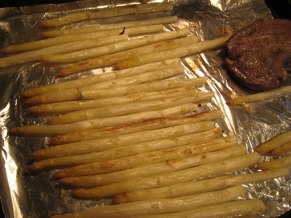

When I saw white asparagus at the store, I thought it was the most bizarre thing. The cashier informed me that white asparagus is grown in buried dirt, so it receives no light. No light means it doesn't turn green. Of course I had to try it and tell everyone. I learned that I'm the last one to hear about white asparagus. Turns out this is old news. What can I say? It was new to me. Anyway, it tasted no different than green asparagus.  _Broiled Lamb and White Asparagus_

---

## Comments

### V.
*April 22 at 2009 at 9:30 PM*

And the pee smell?  Same? :)

---

### MAS
*April 22 at 2009 at 10:01 PM*

Affirmative.

---

### Rachel
*April 23 at 2009 at 2:21 AM*

I wasn't aware of white asparagus either.  It's not as appealing in appearance.

---

