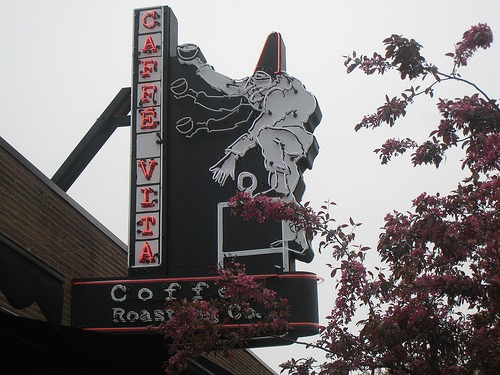

Monday I was heading south to Seward Park. Instead of using my GPS, I decided to just wing it and move my car south and east through the unfamiliar neighborhoods. My thinking was fuzzy. I really should have had another espresso before leaving the house. Then I ran into some dead ends and was forced to return west. I turned left and there was a _Caffe Vita_ location. It was a sign. I had to pull over and recharge. Seattle is loaded with quality coffee shops, however most are concentrated north of this area. This area was outside my espresso radar. The coffee gods were looking out for me.  _Caffe Vita -5028 Wilson Avenue South, Seattle, Washington 98118_ I ordered a double espresso. It is a habit I can not seem to break. In most Seattle places an espresso is a double ristretto. In the rest of the country it is a double espresso. In [New Orleans](https://ineedcoffee.com/locating-a-decent-coffee-during-mardi-gras-in-new-orleans/) it is a bowl of over-extracted undrinkable filth.

> Barista: That will be $2.80. Me: The sign says $2.10. Barista: You are getting an extra shot. Me: I am? Barista (beaming with confidence): You're going to like it. Me: OK.

I love it when a chef, waiter or barista knows what they have is better than what the customer expects and you can sense the confidence. Imagine looking into Michael Jordan's face as he is handed a basketball and an open court._That Look_. My barista had _That Look_. My drink which could best be described as a triple ristretto was amazing. Some people in the industry criticize the _Caffe Del Sol_ Espresso blend, because Caffe Vita pre-blends the beans before roasting. Their loss. It was the best espresso I've had this week.