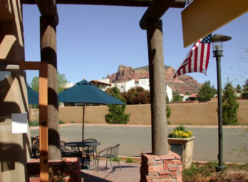
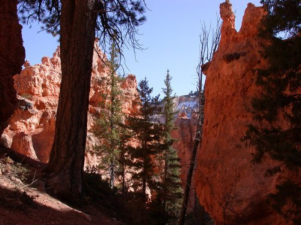
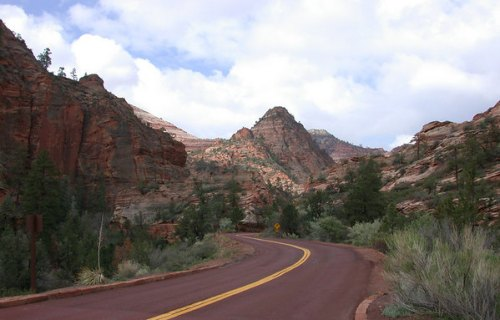

_This article was written after a 2003 road trip through the American Southwest._

In the Southwestern United States there exists an area informally referred to as _Grand Circle_. Grand Circle includes such national parks as the Grand Canyon, Bryce, and Zion. The five states that have at least a portion of their land inside the Grand Circle are Arizona, Utah, New Mexico, Nevada, and Colorado. Millions of people make the journey to Grand Circle to see the natural beauty each year. Although I was certain to be impressed by the handy work of Mother Nature, I was skeptical that mankind would impress me with excellent coffee in these remote areas. Seven days away from a major metropolitan area. Would I find good espresso on the road?

Before I left my house, I packed a canteen. By canteen, I really mean that I roasted up a pound of coffee and loaded a [vac-pot](https://ineedcoffee.com/vac-pot-brewing-with-the-starbucks-utopia/) and grinder into the car. This would be essential for morning survival back at the hotel. However, if I were going to truly enjoy my vacation, I would have to find espresso on the road.

### Sedona

Sedona, Arizona has some of the best hiking in the country. By the time I arrived in Sedona, we had been on the road for several hours. I needed an espresso fix before we started hiking. Fortunately for me, Sedona is very accommodating to the coffee fan. I spotted _Creative Juices_ the moment we pulled into town. _Creative Juices_ had views of Red Rocks beside it. The inside was almost as scenic, as it featured a painting of the Mona Lisa drinking an iced latte.

 _Creative Juices Java Bar in Sedona, AZ_

### Flagstaff

That night we stayed in Flagstaff, Arizona. Although we were just passing through, we stopped at _Campus Coffee Bean_. Despite the fact they way overpoured my espresso, it still tasted good. It was just the thing to hit the spot before heading off to the Grand Canyon. Little did I know that would be the last decent espresso I'd have for days.

### Grand Canyon

I won't go into how beautiful the Grand Canyon is. That's been done before. With the exception of Graceland, this is probably the most important trip an American can make. We spent 2 days here soaking up the wonderful beauty of the Grand Canyon while the local businesses soaked us. The Grand Canyon has perhaps the worst restaurants of any place I've ever been to in my life. Not only is the food bad, but you'll pay twice as much as you thought you should.

 _The Grand Canyon_

One of the most popular articles on INeedCoffee is Alex Fisenko's [Advice on Starting A Coffee Business](https://ineedcoffee.com/advice-on-starting-a-coffee-business/). In the article one of the things Alex stresses is the importance of location. With a good location, you have a license to print money. The only coffee house near the south rim of the Grand Canyon is _Jennifer's Bakery & Coffeehouse_. From the article [Coffee House Stereotyping](https://ineedcoffee.com/coffee-house-stereotyping/), we know rule number 8 is _What gets top billing?_ In short, it states that any coffee house where something other than coffee gets higher billing in either the store's name or menu, you can assume the place sucks. After 3 days without an espresso, my mind couldn't recall that rule and I fell victim to a $3.50 double espresso that was so awful that if it were served to a POW during wartime, the barista could be brought up on war crimes.

INeedCoffee gets a lot of readers. Some of you have thought about the American dream of owning your own business. Maybe a coffee business? Do me a favor. Do America a favor. Learn the art of roasting and the skills of a barista, move to the Grand Canyon, and make yourself rich saving weary travelers from ever having to drink the swill served at _Jennifer's Bakery & Coffeehouse_.

### Bryce Canyon

On the drive to Bryce Canyon Park in Utah, we passed through a little town called Kanab. We had been on the road for hours when I saw a sign with a mug of steaming coffee on it. I spun the car around without concern for the local laws, parked the car, and headed into the _Vermilion Espresso Bar & Cafe_. Inside the cafe, there were pictures of famous TV cowboys. It turns out that some of those classic TV westerns were filmed in this area.

After the Grand Canyon, my expectations were low. The barista served a perfect double espresso. To say I was blown away would be an understatement. It was one of the top 5 espressos I've had in my life. If you pass through Kanab, make it a point to stop here for a coffee. They close in the early afternoon, so get there as fast as you can.

 _Bryce Canyon_

Although we had a great time in Bryce hiking and riding horses, I didn't see any coffee houses. None. This meant for 2 days, I made frequent trips back to the hotel room and my private stash. Coffee supplies were starting to run low.

On the way out we saw an espresso marquee in Hatch, Utah at _Cafe Adobe_. The very friendly owners made us some decent beverages and a killer breakfast burrito. We were on our way to Zion.

 _Cafe Adobe_

### Zion

Our trip was winding down and so was my personal stash of coffee. During my stay at the Grand Canyon and Bryce, I had gone through most of my home roast. Heading into Zion National Park, I'd already started to ration my remaining beans. We didn't stay at Zion but instead drove through the park stopping only to take some pictures. As we exited the park, there was a cafe called _Tsunami_ calling to us from the side of the road. Another excellent espresso from the people of Utah.

 _Zion National Park_

Maybe Utah can offer some sort of barista student exchange with Arizona. Utah could send a few of their best to Arizona and bring them up to speed on proper brewing techniques. _Note: this comment is just reserved for the areas inside the Grand Circle, not the major metropolitan areas of Arizona._

### Home Sweet Home

As soon as we got back home, I fired up [my roaster](https://ineedcoffee.com/why-home-roast/). It was time to retake control of my own espresso destiny. Despite the few espresso mishaps, it was a great trip. If you get a chance to visit the Grand Circle, I encourage you to go. Just be sure to bring your own coffee.

UPDATE 2005 - I received word from _Jennifer's Bakery & Coffeehouse_. They informed me that during my visit in March 2003 they had just relocated and were _ironing out the kinks and putting in a new water system_. They assure me that things are much better now.