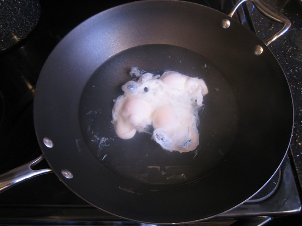
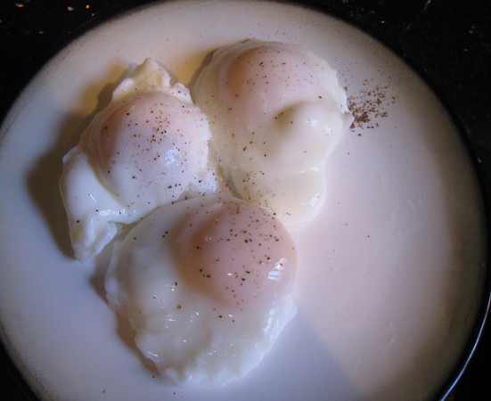

Recently, I was reading about how the body treats oxidized cholesterol differently from regular cholesterol. The oxidized stuff is what you want to minimize. US News and World Reports put out Oxidized LDL Cholesterol Linked to Metabolic Syndrome last year which states:

> Higher levels of LDL cholesterol "packets" that have undergone oxidation are associated with an increased risk of developing metabolic syndrome, a constellation of conditions that can lead to heart attack and stroke, a new study finds.

> A similar relationship was found for the individual components of metabolic syndrome, with people with the highest oxidized LDL cholesterol levels twice as likely to develop abdominal obesity, high blood fat and high blood sugar levels, the study found.

I like eggs. What does this mean? From Dr. Allan Spreen via an email alert on April 3, 2003 (source: June Russell site now offline):

> When cooking an egg, the cholesterol in the yolk is altered when simultaneously heated and exposed to air. **Therefore, eggs should be cooked without breaking the yolks (i.e. poached, boiled, over easy, etc.), instead of scrambled or made into omelets.** A raw blended egg should be drunk fairly quickly, or refrigerated, because leaving it out at room temperature will start cholesterol oxidation, albeit more slowly than by cooking.

Poached eggs, eh? I had never made a poached egg, so I found a video on Youtube. I always thought it was more complicated. It is really quite simple.

1.  Bring water to a near boil
2.  Stir water
3.  Pour eggs into the center
4.  Turn off heat
5.  Pull eggs out in 10 minutes

That is it. I found I could do 3 eggs nicely using a WOK. When I did less than 10 minutes, the eggs were too runny for my tastes. At 10 minutes the egg white firms up a bit and the yolk is medium cooked.   I was so thrilled to have nailed poached eggs on my first attempt that I carried my plate back to my computer a little too fast. Poached eggs are slippery. One of the eggs decided to make a break for it and went airborne. It landed and broke up on (into) my keyboard. I spent a good 15 minutes scrapping the egg out. Thankfully the yolk held together. Now I'm hooked on poached eggs. They taste great and have none of that nasty oxidized cholesterol. Just be sure to walk slowly with your plate, especially around keyboards.

---

## Comments

### Ed
*May 5 at 2009 at 2:04 PM*

I bought the book you highly recommended. "The 150 Healthiest Foods on Earth". He suggests free range eggs with omega-3's. 

I wonder if the 0mega-3 counteracts the negative alteration to cholesterol from the air, since it does so in a general way already, as the author seems to suggest.

---

### MAS
*May 5 at 2009 at 2:11 PM*

Seems like a good strategy.  The MAYO clinic lists OMEGA 3 fatty acids as a <a href="http://www.mayoclinic.org/diseases-conditions/high-blood-cholesterol/in-depth/cholesterol/art-20045192" rel="nofollow">top 5 food against cholesterol</a>.  

I haven't had my cholesterol checked in maybe 5 years.  I've been mostly eating scrambled and omelets.  Might be interesting to see what my numbers are now and the impact of moving to poached eggs.  I love a good experiment.  :)

---

### Paul
*May 6 at 2009 at 11:58 AM*

I think I pulled them out too soon, tried it this morning and the yolk ran all over the place, i can't stomach eggs like that. I'm a big fan of simple omelets and hard scrambled eggs, and hard boiled. I think i'll try a timer next time and less water. The Yolk almost floated right out of the white.

There's always next time

---

### MAS
*May 6 at 2009 at 2:10 PM*

You might try a little white vinegar in the water or reduce the number of eggs.  

The great thing about eggs is they are cheap practice.

---

### Anna
*May 6 at 2009 at 8:29 PM*

Hey Paul
I'm with you on the slimey egg thing, try leaving them in the water until they look like hard boiled eggs they taste better made this way then when boiled with the shell on.

---

### TigerAl
*May 8 at 2009 at 1:13 AM*

Paul,
Important points to remember when poaching eggs: 
1. Use fresh eggs.
2. Break the eggs into a cup and then add them into the water rather than break them directly into the water (vinegar is important too, as MAS mentioned).  If you stir the water in a sort of whirlpool fashion before adding the eggs into the middle, the white part will not spread as much and will wrap around the yolk.
3. Use a slotted spoon to constantly "fold" the cooked white of the egg over the yolk to get a neater and evenly poached egg.

---

### MAS
*May 8 at 2009 at 1:32 AM*

#3 is a great tip.  I'll try that next time.

---

