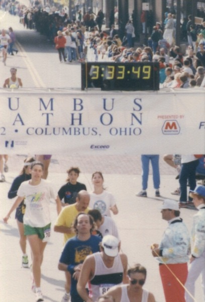

Earlier this week I found this statue hidden up off street level in the lower part of Belltown. Considering I've walked past this area several times before and never noticed it, I'd consider it hidden. While researching this post, I discovered it called _Runners_ and was done by David Govedare.  The best part of this statue was finding this rant in the local newspaper called [The Worst of the Worst](https://web.archive.org/web/20090519020803/http://blog.seattlepi.com:80/art/archives/119758.asp) by Regina Hackett. She really dislikes the statue and lays into it.

> Most art is inoffensive. It doesn't rise to the level of grating. Yet every time I see David Govedare's runners, my outrage is fresh, my recoil real. I've sincerely disliked them since they appeared in 1986, just south of the P-I building on Elliott Avenue West. Ghastly ungainly, they seem flayed alive, **flash frozen in the morgue and cast in metal**. Surely the artist intended something more prosaic, a tribute to those who pound pavement seeking health or a runner's high.

I like her writing. I actually like it more than the statue, but don't many runners have that _morgue_ look? By runners I mean long distance, not sprinters. Look at the photo below  _Dead Man Running - That's me in the green shorts [Columbus Marathon 1992](/2008/03/the-runner-1989-1995/)_ Distance running isn't pretty. At least the statue showed runners looking forward with decent posture.