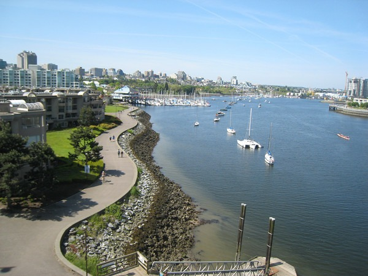

Writing about travel is the hardest thing for me to do. I'd rather hack out 500 words on the stupidity of Ben Bernanke. It pains me to use terms like "_nice_" and "_beautiful_" to describe a trip. That is so boring. I think that is why it has taken so long for me to get this post up. However, when I think of my weekend trip to Vancouver two words come to mind: _nice_ and _beautiful_. The book [Smile When You're Lying](/2008/12/smile-when-youre-lying/) has forever influenced me. The writer exposes the travel industry and the endless positivity that permeates travel writing. Great vacations can make for boring stories or maybe I just don't have a clue on how to say _nice_ and _beautiful_ 10 different ways without making myself nauseous. My Vancouver trip was mostly about the coffee. I will have a detailed report up on [INeedCoffee](https://ineedcoffee.com/vancouver-espresso-vacation/) soon and that will have its own photo gallery. Below are some non-coffee related photos from Memorial Day Weekend 2009 in Vancouver, BC. Look how _nice_ and _beautiful_ it was. :eek:  

---

## Comments

### Matt
*June 2 at 2009 at 3:52 AM*

I love Vancouver - in the summer.

We'll be up there for work in late August. I'll send you the dates. Most of the time we'll be in meetings outside of town at a resort, but we're going to try to spend a couple of days in the city and would love to see you if you're interested.

---

