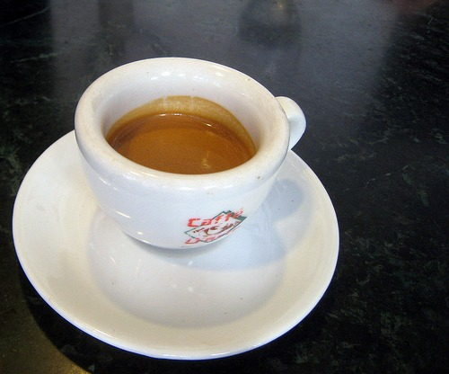

Most cafes have 2 espresso blends. One regular and one decaf. Espresso Vivace has 3. They have a blend for straight espresso and one for milk drinks, plus the decaf. **Caffe D'Arte has 6 different espresso blends!** Four blends are regional Italian, one organic and one decaf. Caffe D'Arte is located in Seattle near Pike Place Market (1625 2nd Ave), but they also have a cafe in Portland and numerous wholesale accounts. Last week I was fortunate enough to be invited down for an espresso (or 4!). In the book Espresso: Ultimate Coffee, Second Edition by Kenneth Davids, I first learned how the espresso culture and roasting style varies throughout the country of Italy. In the north, the roasts are lighter and they get progressively darker as you move through Central Italy and then even darker as you proceed down to Southern Italy. As I read the book, I thought it might be fun to try different cafes that specialize in the different styles of espresso. **Never did it occur to me that one cafe could deliver all the espresso styles of Italy at the same time from a single location.** Caffe D'Arte does.  Like I mentioned earlier, Caffe D'Arte has 6 different espresso blends you can order for your drink. If you don't specify the espresso blend, they will pick the one they feel works best for that particular drink. Straight espresso drinkers will get the lighter blend. The more milk in the drink, the darker the espresso blend choice. Here are their espresso blends and the regional style of that blend:

-   Firenze - Northern Italy (Tuscany / Toscana)
-   Parioli - Central Italy (Lazio)
-   Capri - Southern Italy (Campania)
-   Taormina - Dark Roast (Sicilia)
-   Organic Blend - Available in the cafe.
-   Decaffeinated Blend

These blends do have some robusta beans in them, which provides the espresso with great crema and a taste that lingers in your mouth after you've finished drinking it. Afraid of robusta in your espresso? I like what Steve Leighton wrote in the article [Espresso Blending Techniques](https://ineedcoffee.com/espresso-blending-techniques/).

> I don't care what anyone says to me, I've never tasted a better espresso blend than one with Robusta. Now small amounts (less than 10%) are rules of thumb, and its got to be good quality robusta (there is some out there. In fact I've tasted robustas better than some arabica beans I've been sent). Don't be a snob, it adds a little caffeine kick to a blend, and it gives you great crema and balances out the cup. I have blends without robusta in them that are great, but none are better than those blends which do contain Robusta. Don't let pre-conceptions stop you trying this; with amounts as low as 10% you can't even taste it, but it gives the cup so much more.

I agree with Steve. A touch of robusta beans, although not a requirement, can add an element to espresso blends that I find enjoyable. Caffe D'Arte proves that with their use of robusta coffee beans. As a straight espresso drinker, I favored the Firenze, but also enjoyed the Parioli. The others were too dark for my palate.  If you like Italian style espresso, head over to Caffe D'Arte. Pick your region and your drink. UPDATE 2019: I learned that the Taoramina blend does not contain robusta.

---

## Comments

### Eyal
*June 14 at 2009 at 6:24 AM*

Been there. Great coffee! I got there as part of the research I did for my future coffee book. Go for the lighter blends if you drink espressos. Thumbs up!

Eyal

---

