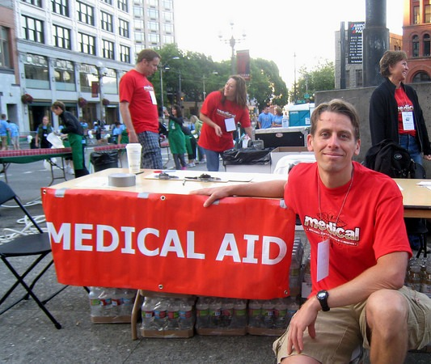

I didn't mention this earlier, but I _signed up_ for the 2009 Seattle Rock 'n' Roll Marathon which took place this past Saturday. Surprised? You shouldn't be. I am still in [retirement](/2008/03/the-runner-1989-1995/) when it comes to running. I signed up as a medical volunteer for the race.  Medical volunteers arrived at 5:45 AM. We set up our station at the 14.3-mile marker and then waited for the injured to visit us. We waited and waited. Because the weather was so cool, we didn't get any heat exhaustion cases. We had very few runners that needed assistance and I ended up spending a good amount of time across the street at _Trabant Coffee_. I'm so glad I encouraged them to open 3 hours early for the race. Even though I now consider distance running to be bad for your health, I understand the runner's high. Completing a marathon is a great life experience. Here are two ideas to improve your next marathon time.

1.  If your marathon time was greater than 5 hours, I can almost _bet the farm_ your posture sucks. **The most common feature with the "back of the pack" runners was not age, body type, or sex, it was posture. It was lousy.** Have someone watch you run. Fix your alignment and posture and your time will improve. With a 50 centimeter stride, you will take [84,000 strides](https://web.archive.org/web/20150411063515/https://uk.answers.yahoo.com/question/index?qid=20081006114907AA2N5Gv) in a marathon. Minor improvements in posture will really help your time. You'll also feel better the next day and have a faster recovery.
2.  Here is some more motivation to run faster. The water cups you are handed as you run the race are filled prior to the start of the race using fire hydrants. Before the fire hydrant hose is turned off, lined trash containers are filled with water for easy refill access. On a hot day, the aid stations will refill from these containers. No problem, right? Not unless spectators start throwing trash in them. Notice the photo below. You can see the empty coffee cups. What you don't see in this photo: a stick with Vasoline on it, gum, and something a homeless dude put in there. **If the race has warm weather, don't be in the "back of the pack" or there might be something yucky in your water.**

 Here I am in front of our Medical Aid station. 

---

## Comments

### Ed
*July 1 at 2009 at 3:00 AM*

Do you have the "posture and alignment" DVD ?.

I bought an inversion table last weekend for my lower back muscle problems. I might resort to other ideas if convinced enough.

---

### MAS
*July 1 at 2009 at 3:14 AM*

Yes.  I own both volumes of the Egoscue DVDs.  I also have 3 of Peter Egoscue's books.  Of all the strategies I've come across for reducing back pain, I have found his stuff to be the best.

---

### Nikki
*July 9 at 2009 at 6:53 PM*

Interesting observation on posture and running times. Makes sense though. I'm linking this to one of my blog posts. Hope that's cool...

---

### MAS
*July 9 at 2009 at 7:12 PM*

Sure.  It would be an honor.

---

### Nikki
*July 11 at 2009 at 4:26 AM*

Awesome. Thanks :-)

---

