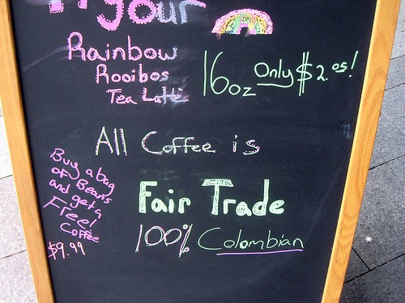
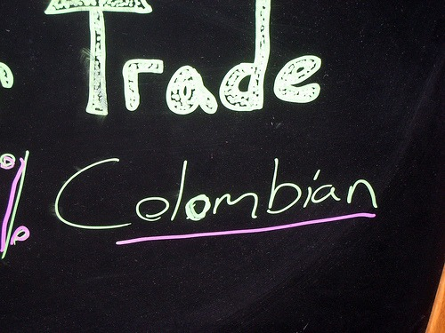

Sometimes you just know with a coffee place. All my internal alarms were telling me that the _Juan Valdez Cafe_ would not live up to my standards. Since people have asked me for my opinion on this place more than once, I figured I'd give it a try. The _Juan Valdez Cafe_ states they use 100% Colombian Coffee. Like I care. Almost every coffee-growing region is capable of growing quality coffee. The caliber of the drink I was soon to consume was foreshadowed by the silly name and the sidewalk sign. **Notice in the photos below how if looks like they corrected the** **misspelling of Colombia****.** Maybe I'm imagining things. You be the judge.   Enough about the sign. How was the drink? My standard test is always an espresso. I feared the barista was going to over-pour the shot, so I asked that he pull the shot short. It didn't matter.  Over-poured and bitter. It may appear that I had the flash on my camera for this shot. I assure you I didn't. From the photo chart _Crema! A Sign of Good Espresso, or a Symptom of Bad Espresso_ by SweetMarias, I am guessing that this espresso was under-extracted. I asked the barista if anything other than Colombian was in the espresso blend. Nope. So this espresso had 3 things working against it:

1.  Over-poured.
2.  Under-extracted.
3.  100% Colombian may be great for drip coffee, but this particular offering did not deliver as a single-origin espresso. It lacked the depth and flavor one expects from espresso.

The espresso was so tasteless, I only drank two sips (one while hot, the other after cooling) before handing it back to the barista. The _Juan Valdez Cafe_ will not survive in Seattle. Stick to growing coffee. Leave espresso to the professionals. UPDATE (Aug 7, 2009): The Juan Valdez Cafe Bites it in Seattle _Sources:_ [Crema! A Sign of Good Espresso, or a Symptom of Bad Espresso](https://web.archive.org/web/20150619201322/http://www.sweetmarias.com:80/library/content/espresso-almighty-crema) - Photo chart from Sweetmarias.com. [Juan Valdez Cafe](https://en.wikipedia.org/wiki/Juan_Valdez_Cafe) - From Wikipedia. Juan Valdez Cafe - Official site in Spanish.

---

## Comments

### Mike
*June 25 at 2009 at 9:03 PM*

I've thought about returning bad coffee before, but usually I need the caffeine so I end up keeping it and then writing about it on my blog.

---

### Michael
*June 25 at 2009 at 9:12 PM*

Having me return this espresso in Seattle would be like demanding a refund on a grade school performance of Peter Pan.  I knew the risks.  :)

---

### Brenda
*July 15 at 2009 at 2:05 AM*

I was in Colombia just last week and had espresso at Juan Valdez cafes in both Cartagena and in Bogota.  Both were prepared perfectly.  Perhaps there is something wrong with your equipment and/or the capabilities of your baristas in Seattle.

---

### Michael
*July 15 at 2009 at 4:31 AM*

Brenda,
I am interested in traveling to Colombia.  If I get down there I will give JVC another try on their home turf.  Thanks.

---

### Erin
*August 13 at 2012 at 11:28 PM*

I have been to Colombia numerous times and always get my coffee from Juan Valdez.   I even bring back pounds!   It is, by far, the best coffee anywhere!

---

