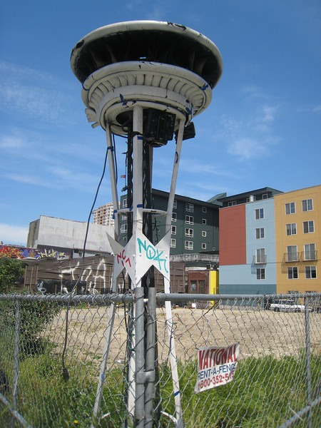

Did you know Seattle has a 2nd _Space Needle_? This version of the _Space Needle_ can be found at the corner of 2nd and Bell in the Belltown area, which is just north of downtown. Details on this art project can be found on [ANDIE DE ROUX - ART BLOG](https://web.archive.org/web/20131106013049/http://andiederoux.blogspot.com/2008/12/space-needle-at-2nd-bell-in-seattles.html).

