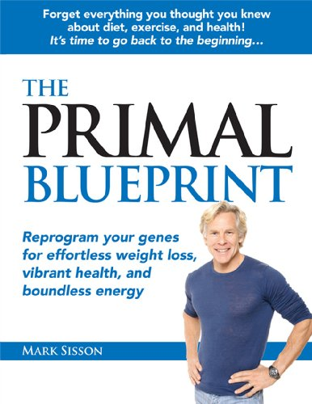

The newest trend in nutrition is actually the oldest trend. Evolutionary nutrition and fitness are gaining momentum online. When it comes to diet, I've been slowly moving in the [evolutionary direction](/2009/01/maybe-i-think-too-much-but-some-things-wrong/) for a year now. One of the blogs I read regularly is _Mark's Daily Apple_. When Mark Sisson came out with a book on evolutionary nutrition, I knew I had to get it.

 The Primal Blueprint: Reprogram Your Genes for Effortless Weight Loss, Vibrant Health, and Boundless Energy

_The Primal Blueprint: Reprogram Your Genes for Effortless Weight Loss, Vibrant Health, and Boundless Energy by Mark Sisson_ is the first book on evolutionary fitness that is easy to follow and accessible way for the average person to learn about evolutionary nutrition. Perhaps "learn" is the wrong term. Maybe "remember" is a better term.

The premise of evolutionary nutrition is that man has not evolved to handle the high carbohydrate diets that we eat today. Disease and obesity are rampant in modern times and only getting worse. By returning to diets based mostly on plants and animals and avoiding the modern poisons, our health and quality of life will improve measurably. Modern poisons are not limited to just _junk_ food, but also include grains, sugars, and chemically altered fats. Mark Sisson also endorses [intermittent fasting](/2009/04/intermittent-fasting-fears-and-motivations/) and like me assigns 80% of fat loss to diet.

The fitness portion of the book mirrors my exercise philosophy: lift weights and walk. He also likes sprinting and like myself is very [anti-cardio](/2008/10/why-do-i-diss-cardio/). Did I mention the author is a former elite marathoner and Ironman competitor?

I highly recommend this book. Even though I knew most of the information in the book already, I did learn a few things and my understanding increased as well. Not only am I recommending the book, because it was well written and edited, but also because I've put a lot of these principles into practice in the past year and I KNOW they work.

---

## Comments

### Ed
*June 28 at 2009 at 5:14 AM*

sounds like an interesting book. I will pick one up too. Thanks

---

