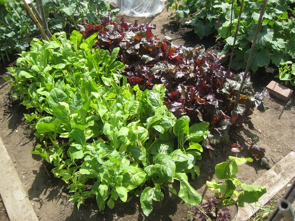

Saturday morning I went out to Woodinville, Washington to check out the 21 Acres Farm. _21 Acres_ is a local, organic sustainable farm. About once a month they have a Sustainable Saturday, which includes a tour of the farm.

I first learned about _21 Acres_ after seeing the movie Fresh. When the movie the ended the filmmaker took questions and comments from the people in the audience. One guy mentioned the _21 Acres Farm_. It sounded interesting, so I went.

Before the tour started, I was able to help on a farm project of laying netting over a bean patch. Apparently rabbits like beans as much as humans. They don't like sticking their paws through netting though.

_Get in my salad!_

_Get in my stir fry!_

If you live in the Seattle Metro area and would like to see how a working sustainable organic farm operates, attend one of their Saturday tours.

---

## Comments

### Andrew
*July 10 at 2009 at 5:32 AM*

Do they have organic grass-fed livestock or just organic veggies?

---

### MAS
*July 10 at 2009 at 5:41 AM*

Just veggies now, but they are expanding.

---

### Nikki
*July 11 at 2009 at 4:27 AM*

Cool. I'll have to check this out sometime.

---

