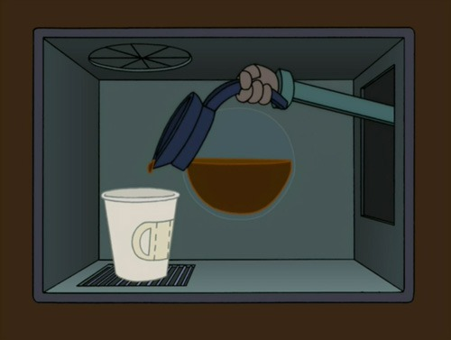

When it comes to the TV show _Futurama_, I must confess to being late to the party. Even though the series ran from 1999-2003, I just started watching it this year. Thanks to Netflix, I was able to watch every episode back to back. One episode I want to highlight in a new series called _Coffee on TV_ is _Three Hundred Big Boys_. _Three Hundred Big Boys_ (S05E11) aired on June 15, 2003, and had a strong coffee subplot. In this episode, each citizen is given a $300 rebate check from the government. The main character Fry decides he will spend it on 100 cups of coffee (priced at $3 each in the year 3000).   At first, the massive amounts of coffee made Fry irritable and angry.   Right before Fry consumes his 100th cup of coffee a fire breaks out. Instead of rushing to safety, he buys his 100th cup of coffee and drinks it. At that point, a calmness overcomes him and he gains superhuman speed. In a moment of pure clarity, he was able to rescue every person from the burning ballroom in the blink of an eye. **The power of coffee extends into the 31st century!**  _Futurama is the property of 20th Century Fox_.  Futurama, Vol. 4