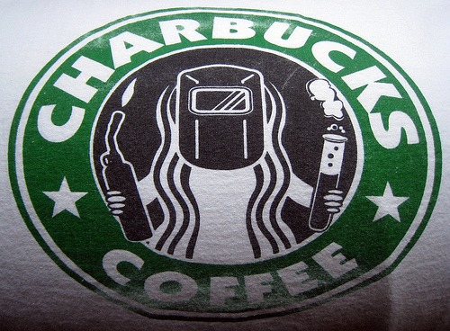

Is anyone else tired of how the coffee blogosphere hyperventilates after every Starbucks press release? Coffee sites that claim to dislike Starbucks are all too eager to spread everything Howard Schultz says. Because I've run [INeedCoffee](https://ineedcoffee.com) since 1999, I get asked about different things Starbucks does frequently. My answer is I really don't care. To me, Starbucks represents the past. They are an important chapter in coffee history and I thank them for their contribution, but I've moved on. I know how to roast my own coffee. I have a great espresso machine. I live in Seattle, which although home to Starbucks, has much better options. Cities like Portland, Vancouver, and San Francisco are leading in what coffee people refer to as the _Third Wave_.  Don't get me wrong, I am not anti-Starbucks. If I'm stuck at an airport or someplace where the espresso culture hasn't evolved (like [New Orleans](/2012/02/locating-a-decent-coffee-in-new-orleans/)), I will line up for espresso. However, when I travel now, I usually bring quality tea with me. It is easier and more portable than bringing coffee. My challenge to the other coffee blogs: **The next time Starbucks releases a press statement - ignore it.** Maybe even do a post about an independent coffee retailer that doesn't have a marketing budget.

---

## Comments

### Mike
*August 1 at 2009 at 1:11 PM*

I'm a reluctant fan of Starbucks. I love making my own coffee at home, however, when I'm out there aren't many other choices for coffee other than Starbucks in this area. I do keep finding more local shops, but they're still few and far between.

I have been focusing more on smaller coffee suppliers, not on purpose, just kind of worked out that way. However, when Starbucks does something like create/copy a whole new style of store, I do want to write about it...for better or worse.

But really, you have a good point. I'll see about taking you up on that challenge.

---

### Michael
*August 1 at 2009 at 2:02 PM*

Mike -
This post was directed at the sites that claim to be anti *$, but yet can't stop talking about them.  I agree that the new store style in Seattle is a huge story and since it is nearby, I will "take one for the team" and visit it soon.  I will probably visit Victrola Coffee while I'm in that area as well.  ;)

---

