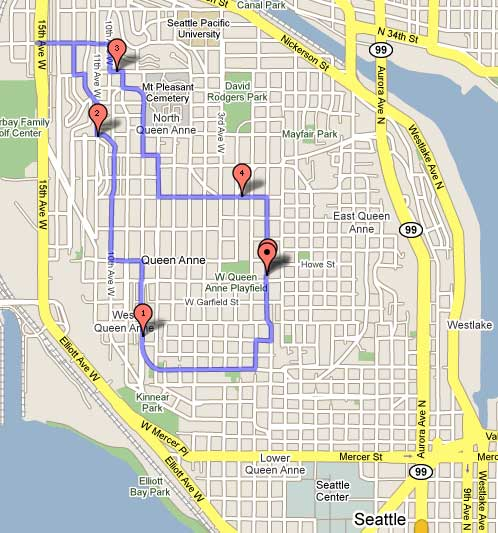
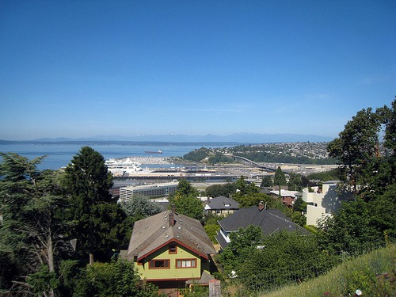

As the organizer for the _Coffee Club of Seattle_, one of my roles is locating and trying new coffee places in the Seattle area. If the place serves excellent espresso, has enough space and isn't too crowded, I will set up an event for our group. The first step is finding new places. One strategy that I have used many times is the espresso hike.

The espresso hike is when I go on random city hikes through Seattle looking for new coffee places. I change the neighborhoods and I always try to walk down different streets. A typical espresso hike is about 6 miles, but I've gone as far as [22.5 miles](/2009/02/urban-hike-seattle-225-mile-edition/).

When I mentioned my espresso hikes to some members of the group they seemed interested in joining me. So last Friday I mapped out a 4.5 mile route in my neighborhood of Queen Anne and invited them along. We started with 11 hikers and by the time it was over we had 14 in our group.

Espresso Hike #1 covered 4 locations. Not everyone had a drink at every location. The idea was to send in a scout party to try it. If the coast was clear, others would order. That was the idea. In the end, people ordered from the places that most appealed to them. Here was our espresso itinerary.

1.  **El Diablo Coffee Company** - This may be the most unique coffee place in Seattle. Espresso is done in a Cuban style. Having lived in Tampa for 4 years and visited Miami a few times, I will say this is better than anything you will find in Florida. The quality of the beans is superior, and unlike the Tampa/Miami Cuban Coffee, it isn't roasted to death. The drinks are served in ceramic, not those little Styrofoam thimbles. As well as they do the Cuban style, our group had a mixed review with a slight bias to the positive. Some liked the sweeter drinks, some didn't.
2.  **Muse Coffee** - Our group has been to Muse many times. It is the best place in Queen Anne. I added this place to the hike at the last minute. It would be a crime to pass through West Queen Anne with a posse of espresso drinkers and not visit Muse.
3.  **Q Cafe and Community Center** - This gem is located in Interbay on the exit that separates Queen Anne and Magnolia. They are only open on weekdays and they serve _Stumptown_ _Coffee_. We enjoyed our drinks and loved the spacious venue.
4.  **Bustle Seattle** - The last stop was a new place that served a unique selection of food and an Italian espresso called _Antipassi_. The group liked the venue and the food, but not the espresso. It really is hard to beat locally roasted coffee from Seattle with imported Italian. The staff was great. I would love to see them use a local roaster that captures the Northern Italy style. Perhaps _Espresso Vivace_?

 _This was our view as we headed to Muse Coffee._

Our group loved the caffeinated journey through Queen Anne and nobody collapsed hiking up the hill, so I will most likely plan future espresso hikes. If you live in Seattle and this sounds like fun, [join our Coffee Club](https://www.meetup.com/seattle-coffee-club/) and look for emails on upcoming events.

_Sources:_

[Espresso Hike #1](https://www.meetup.com/seattle-coffee-club/events/10772787/) - The event page along with photos and reviews.

[GMAP Route](http://www.gmap-pedometer.com/?r=2990202) - A rough map of our espresso hike.

El Diablo Coffee Company - 1811 Queen Anne Ave N

Muse Coffee Company - 1907 10th Ave W

Q Cafe - 3223 15th Ave. W

Bustle - 535 W McGraw St

---

## Comments

### Alex
*July 10 at 2009 at 4:12 AM*

OK, it's official -- I miss living in the city.  I doubt I could do an espresso hike on Cape Cod without a car -- or at least a bike.  For a pedestrian-feasible espresso hike, I'd probably have to head up to Boston.

---

### Mike
*July 10 at 2009 at 11:29 AM*

I know we couldn't do an espresso hike here, it would be more like a drive. However, since I moved to the Tampa area only a year ago, I do like to do a lot exploring and looking for new coffee places. I've found many on random drives and bike rides. Then I've also discovered a few too many that have closed.

---

### Michael
*July 10 at 2009 at 1:37 PM*

Good old Tampa.  I was there from 1994-1998.  Not much of a coffee scene.  Lots of bars and strip clubs though.  And <a href="https://criticalmas.org/2008/01/that-time-i-got-in-a-car-chase-with-hulk-hogan/" rel="nofollow">Hulk Hogan</a>.  :)

---

### Gabe
*July 10 at 2009 at 5:32 PM*

Ahh!!! Now I know that I didn't get to drink the best of Queen Anne! I guess the early bird gets the bean. Hmm.

It was a great hike. MAS rocks.

---

### Candace
*July 11 at 2009 at 10:21 PM*

What a brilliant idea! I've never been Seattle but, I'm told I'd enjoy it if for no other reason than the multitude of divine coffee shops! :)

---

