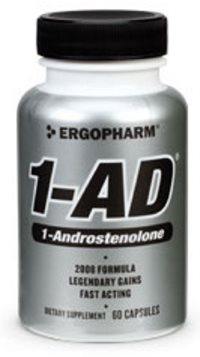

I have no love for baseball. Not only is the game boring, but they have a childish view of steroids that I don't have the energy to debate at this time. This post is about a story I saw on the cover of USA Today this week. It appears it is front page news that a baseball player was taking a legal supplement that was not approved by major league baseball over five years ago. I can comment on this story, because I took the same supplement. The supplement is androstenedione (aka andro). From the story Arroyo: I Took Andro The Same Way I Took Vitamins by Ian Preuth:

> Arroyo had trouble gaining weight and strength early in his career, according to the report. He says that changed in 1998 when he discovered androstenedione (andro). He took andro until it was banned in 2004, according to the report. "I took androstenedione the same way I took my multivitamins. I didn't really know if this was a genius move by Mark McGwire to cover up the real s- he was taking, but it made me feel unbelievable. I felt like a monster," Arroyo told USA Today. Arroyo says he never knowingly took steroids but wouldn't be surprised if his name is on the list for taking andro contaminated with steroids.

It wasn't enough for baseball to go after the guys who allegedly took steroids. Baseball is now making a fuss about a supplement that was LEGAL and the player ceased taking it once it was made illegal, because it produced steroid-like effects. **Silly middle aged men will do anything to destroy the heroes of today to preserve the records set by their childhood heroes.**  Way back in 2003, I did an 8 week cycle of andro. It was a legal pro-hormone supplement that I purchased online. In 8 weeks, I went from 211 pounds to 222 pounds. Did I feel like a monster? Sure did. Adding 11 pounds in 8 weeks felt awesome. What happened when I stopped using andro? I went right back to 211 pounds. It was like nothing happened. **There was no lasting physique or performance improvement.** Therefore, I consider andro to be a waste of money. Does andro even work? From the Wikipedia page on [androstenedione](https://en.wikipedia.org/wiki/Androstenedione#Androstenedione_as_a_supplement):

> A 2006 review paper summarized several studies which examined the effect of androstenedione on strength training. At dosages of 50mg or 100mg per day, andro had no effect on muscle strength or size, or on body fat levels. One study utilized a daily dosage of 300mg of androstenedione combined with several other supplements, and also found no increase in strength when compared to a control group that did not take the supplements.

How did I gain 11 pounds if these studies showed the supplement to ineffective? Probably the placebo effect. I just bought this expensive pro-hormone supplement and I was going to use it to its full potential. For eight weeks I lifted like crazy, ate like a monster and took andro. Surprise, surpise, I gained weight and was on such an endorphin rush that I felt great. When the cycle ended, I resumed normal eating and exercise patterns and the "_gains_" went away. The only edge Androstenedione gave this pitcher was psychological. If it helped his training and he walked up on that mound feeling like he was a _badass mofo_, then for that moment he had an edge against that batter. Baseball needs to stop tearing down the accomplishments of its best players or one day the stands will be empty.