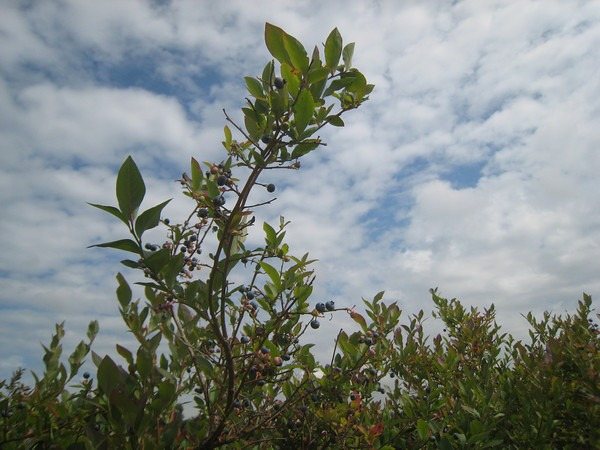
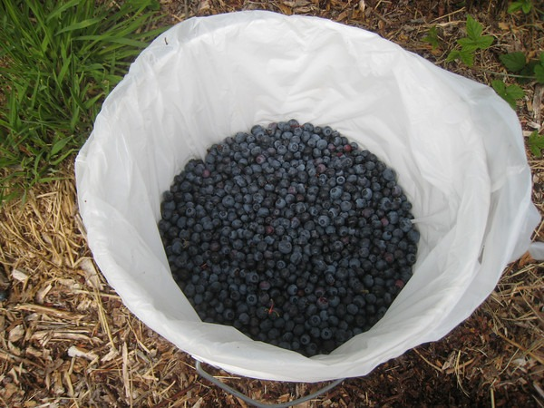

If you head east of Seattle this time of the year, you will find many places that have a U-Pick-Em blueberry program. They hand you a bucket and you make your way out onto the farm to pick your own blueberries. When you are finished, they weight the blueberries and then charge you around $1.50 a pound. I love blueberries, so last week I headed East to get my bounty.  Marketman said he picked over 20 pounds of blueberries. I only got about 8 pounds and I had help. The night after picking blueberries, I had a dream where I kept picking more blueberries. If you have space in your freezer, seek out a blueberry farm and start picking.  My tip is to avoid the _Mercer Slough Blueberry Farm_. It is over picked at this point. If any of my fellow Seattle blueberry pickers are out there, post in the comments which farms you liked.

---

## Comments

### t.bone
*August 21 at 2009 at 6:35 AM*

I would love to go the midget farm and pick some berries.  I believe it is very close to Portland.  The farm is featured in the tv show "all the small things" with the little family (in stature not members).

---

### Marketman
*September 2 at 2009 at 11:46 PM*

I know a few awesome places but I dont dare post them on this blog for fear that word will get out and I'll miss my 200 pound quota before the season ends.  But I will say that yes, you should avoid any Blueberry farms with a Bellevue address.

---

