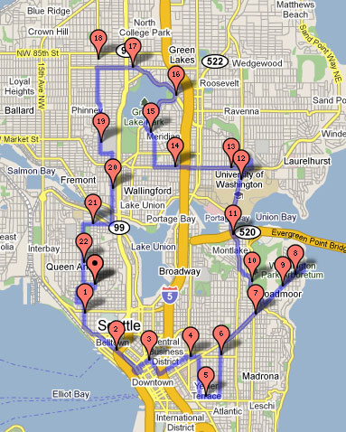

I only intended to do a 5 mile hike today, but decided to take a few different turns and I ended up exploring a new section of Seattle. I didn't know there was a beach with a diving board at Madison Park. This ended up being my longest hike to date by a hair. In February, I hiked [22.5769 miles](/2009/02/urban-hike-seattle-225-mile-edition/). Today, I logged 22.5988 miles. I'm rounding that puppy up to 22.6! This hike was much slower as I am [no longer wearing](/2009/08/learning-how-to-walk-again/) shoes with cushioned heels. Unlike the hike in February, I experienced no back pain. However, my feet are tired. That is a fair trade off in my opinion. 