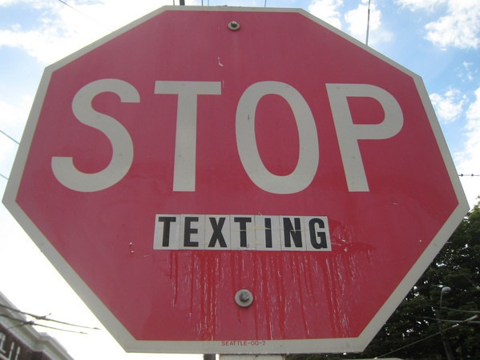

I just setup a text message block on my phone. As a cell phone customer, I have two options:

1.  Buy an unlimited text plan, for which I'll never use.
2.  Pay 20 cents to send and 20 cents to receive each text message.

The unlimited option is a total waste of money for me, which leaves option 2. I have no problem with paying 20 cents to send a text. My issue is that I have to pay to receive texts. For 20 cents, I can buy a banana. So every time I get an idiotic text, it is like someone reaching into my kitchen window and stealing a banana. Yeah I know, I'm an old man. I don't IM either. I am not a fan of short burst communication. It is almost all noise with very little [signal](/2008/12/signal-vs-noise-consume-vs-create/). Feel free to call me, email me or even write me a letter. I pick and choose the technologies that benefit and enrich my life. Texting is not one of them. 

---

## Comments

### Andrew
*September 5 at 2009 at 7:23 PM*

Most phone companies also offer in between options, where you pay like $5 for 500-1000 messages.  So basically, you get cheaper text messages up to a certain limit.  I think for you, the no text message option is best, but you shouldn't misrepresent that there is no middle ground.

---

### MAS
*September 5 at 2009 at 7:32 PM*

I was unaware of such plan and it wasn't mentioned to me as an option.  After your comment, I went to the AT&T site and found a plan called MESSAGING 200 for $5.00.  That seems fair.  I wonder why they didn't tell me about it?

---

### David
*September 5 at 2009 at 8:03 PM*

I was going to text you about the MESSAGING 200 plan, but...

---

### TigerAl
*September 6 at 2009 at 5:53 PM*

They probably did not tell you to make up for all the secret ways that you save money with AT&amp;T and Vonage: 
https://criticalmas.org/2009/07/secret-ways-to-save-money-with-att-and-vonage/ :)

---

