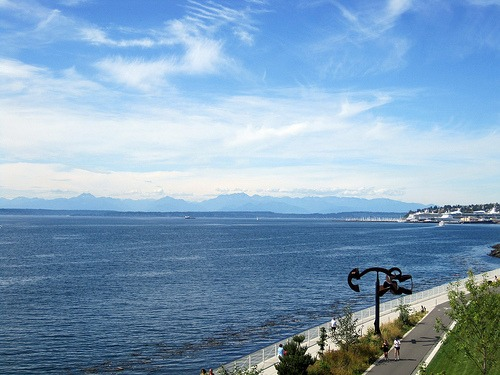
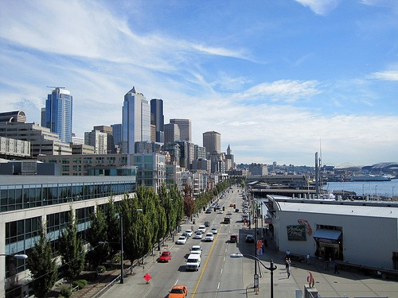

[Espresso Hike #1](/2009/07/the-espresso-hike-1-queen-anne/) was so successful that the Coffee Club of Seattle did a second one last Friday. If you wish to learn more about the background of the _Espresso Hike_, be sure to read [Espresso Hike #1](/2009/07/the-espresso-hike-1-queen-anne/). This hike started at the top of Queen Anne at Kerry Park and then went South to downtown.  We had 12 espresso hikers for our 5-mile journey. The weather was excellent.    Espresso Hike #2 covered 2 places.

1.  **Fonte** - This is the new flagship store for Fonte roasters. It is across the street from the Seattle Art Museum and part of the Four Seasons Hotel. This coffee house is designed more like a cocktail bar than a traditional coffee house. They did serve alcohol and a wide range of food, including omelets. They had both a blended and a single origin espresso. The staff was super friendly and our group enjoyed this place.
2.  **Stella Coffee** - Just a block away and across the street from Fonte was Stella. This is their flagship store. They roast in the traditional Italian style adding some premium robusta to their blend. They too have beer on tap. Stella has a large room in the back, which is where our group rested before heading back up to Queen Anne.

Our group liked both places. If you live in Seattle and this sounds like fun, join our [Coffee Club](https://www.meetup.com/seattle-coffee-club/) and look for emails on upcoming events. _Sources:_ [GMAP](http://www.gmap-pedometer.com/?r=3179969) - Saved route of Espresso Hike #2 (rough estimate). [Espresso Hike #2](https://www.meetup.com/seattle-coffee-club/events/11246398/) - The event page along with photos. Stella Coffee - 1224 1st Ave, Seattle. Fonte Coffee Roaster - Seattle, WA. Kerry Park - City website.

---

## Comments

### t.bone
*September 12 at 2009 at 6:41 AM*

Looks like a fun walk, found your site through looking for a coffee-maker here in Snoqualmie.  Is expresso coffee juice concentrate?  Thanks, I think it will help clear up some misunderstandings others and I may have.

---

### Michael
*September 12 at 2009 at 4:18 PM*

Espresso is <a href="https://en.wikipedia.org/wiki/Espresso" rel="nofollow">concentrated</a>.

---

### t.bone
*September 14 at 2009 at 4:14 PM*

Thanks again for the infor! I've checked your site a few times and it always makes me hungry for coffee! LOL

---

### t.bone
*September 27 at 2009 at 7:29 PM*

intresting article on coffee juice shops..

http://www.nbcnews.com/id/33045689/ns/business-food_inc/

---

