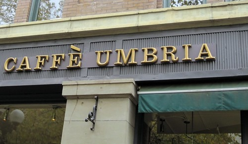

In the past two years I've had many excellent espressos here in Seattle. However, not every espresso is great. Some have been lousy. Now on any given day, it is possible to get a bad espresso from an otherwise good coffee shop. Because we have so many great coffee shops, if I get a bad espresso from one place, I probably won't go back. There are just too many great choices. This week I decided I'd give three places a second chance. All past mistakes would be forgiven. The slate would be wiped clean. Here is how my _Espresso Forgiveness_ journey went. **Caffe Fiore (QUEEN ANNE)** It has been over 6 months since I went to Caffe Fiore. On my last visit, I got an over-extracted espresso from a barista who was not trained properly. I knew Fiore could make a great espresso, as I've had a few in the past and purchased their whole bean blend as well. Espresso Forgiveness #1 was a success. I had a great espresso from Caffe Fiore. **Caffe Ladro (QUEEN ANNE)** In fairness to the good people at the Queen Anne location, I stopped going to Caffe Ladro because of the poorly trained barista at the new Issaquah location. Back in the spring, I got an awful espresso from them. Espresso Forgiveness #2 was a success. Although this blend isn't my favorite, it was still good. Not outstanding, but good. I'm still afraid of the Issaquah location. **Caffe Umbria (PIONEER SQUARE)** It has now been two years since I went to Caffe Umbria. It is an Italian-style espresso made with 100% Arabica beans. I prefer a little [robusta in my Italian espresso](/2009/10/espresso-vivace-dolce-now-without-robusta/), but it is possible to create a good Italian espresso without robusta. On my one visit two years ago, my drink was made correctly (I think), but the flavor was bitter. Espresso Forgiveness #3 was a failure. Not only is this espresso blend tasteless and bitter, but my double ristretto was served in a cappuccino cup. How this place stays in business when it is located between two vastly superior espresso places (Zeitgeist and Stella) amazes me.  _Caffe Umbria in the Pioneer Square area of Seattle._ The Espresso Forgiveness project was a success. I was able to add two coffee places back into my rotation (Fiore, Ladro) and send one to the "dead for life" list (Umbria). I might do this again.

---

## Comments

### Andrew
*October 20 at 2009 at 10:55 PM*

Inconsistencies in quality and flavor, in my opinion, make the businesses more authentically Italian.  As it was described to me once by an Italian national, "coffee is like a woman: sometimes beautiful, sometimes ugly, but you have to love them all."

---

### Michael
*October 21 at 2009 at 12:34 AM*

Sounds like something an ugly woman said. ;)

Well there are too many beautiful ones to waste time on the ugly ones.  If Umbria was half way between Seattle and Vancouver, I might stop in and get a cappuccino.  Straight espresso?  Not again.

---

### Mike
*October 21 at 2009 at 10:39 AM*

One of the things that I think about when I'm doing a review of a coffee that I don't like is that maybe it was just a bad bag, or I got a stale cup that day. I start making a lot of excuses for them...then I try to put it all perspective by thinking that it's a real world test, if I was a normal consumer, that's what I would've gotten that day. That would be my real reaction. No excuses. But maybe second chances now, after reading this.

---

### Michael
*October 21 at 2009 at 2:06 PM*

I wouldn't extend forgiveness to a cafe or roaster that screws up drip or french press.  The window of success is too large, whereas espresso can be saved or ruined by a few seconds.

---

### Farnoosh
*October 21 at 2009 at 6:05 PM*

Ok this is hilarious. You realize you are a big espresso snob (that's why I like you :))! Seriously, we had this conversation with my hubby when vacationing in your lovely Seattle: If the barista in any coffee shop messes up, they just can't possibly keep up with the competition, and savvy customers with so many choices just won't go back - but then again, you do have to have a well-developed taste buds to know the difference. I mean, come on: Starbucks is in business with their burnt beans and that awful smell!!

---

### Jason
*October 21 at 2009 at 9:00 PM*

This was my favorite line, "Not outstanding, but good.  I’m still afraid of the Issaquah location." very funny. If I have bad anything it is very hard for me to go back as well. I will have to think if any of the places I have been will get second chances. I hope you do this again, it was fun.

---

### Michael
*October 22 at 2009 at 4:25 AM*

Jason - There will be a second edition of Espresso Forgiveness.  Round one was the safer bets.  For Round two, I'll go deeper into the espresso underbelly of Seattle.  :)

---

### thomas
*October 23 at 2009 at 6:30 AM*

I think you are being a bit harsh.  I find as long as the coffee is strong, I will like it.

If coffee is like a woman it is a bit like the song "fat-bottom girls by QUEEN"  because similar to a full-bodied coffee...they both make this rockin' world go round.

---

### Michael
*October 23 at 2009 at 3:46 PM*

We are all at different points in the coffee journey.  What I liked 5 years or 10 years ago is not the same as what I like today.  Taste evolves.

---

