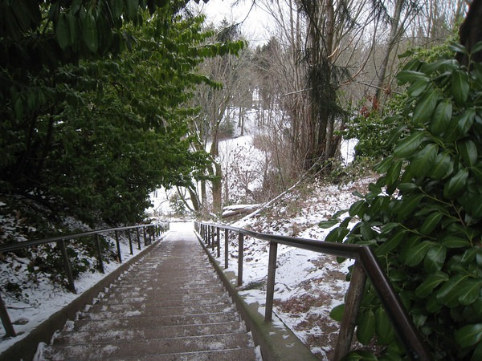

Last winter I did a cold weather exposure project that I named [No Jacket Required](/2008/12/no-jacket-required/). It involved going without a coat the vast majority of the winter. From the post [Still No Jacket Required](/2009/04/still-no-jacket-required/):

> Other than the Seattle snowstorm, I went this entire winter wearing at most a long sleeve shirt. On most days, even those that got into the low 30s, I remained in a short sleeved shirt. What did I learn?
> 
> 1.  The body is fully capable of acclimating to cold temperatures. The first few minutes are always the worst.
> 2.  My hands never got used to the cold and would get numb in cold weather. Wearing gloves or putting them in my pockets was essential.
> 3.  Movement is very important. The body does not appreciate standing still in cold weather. Even a slow walk is enough to keep warm or at the least, not be painfully cold.
> 4.  Respect the wind. It will chill you to the bone faster than cold temperatures. Limit exposure on windy days.

Well summer is over and the temperatures have dropped. **I am challenging you to go this winter with one less layer than you did last winter.** You don't need to be as extreme as me. I also understand that an Ohio winter is a meaner beast than a Seattle winter. One less layer is worthy goal for all. Why on Earth would anyone consciously expose themselves to cold weather? Let me list the reasons in order of importance.

1.  **Expand Comfort Zone (aka Toughen up)** - After living 7 years in Southern California, I got soft. If the temperature got into the mid 60s, I would get cold and reach for a layer. When I was exposed to really cold temperatures on ski trips, I was beyond miserable. I had a 20 degree comfort zone (67 - 87 Fahrenheit). Last year's cold weather training expanded my comfort zone 30 degrees. If the temperature were to ever drop to 20 in Seattle, I know that a single flannel shirt would be enough for me.
2.  **Learn How to Deal With Minor Stresses** - This was an idea I got from evolutionary fitness guru Art De Vany. If you periodically expose yourself to minor stresses, the body will be more adapt to deal with major stresses later in life (strokes, heart attacks). Having short term exposure to cold temperature is a minor stress. The body must adapt. Like any system that has forced adaptations, it becomes more [resilient](/2009/10/the-upside-of-down/). Varying exercise and caloric intake are the most common examples of forcing adaptations on the body. Temperature is another method.
3.  **Activate BAT (Brown Adipose Tissue)** - Some of you may have forgotten, but [two medical studies](/2009/04/the-media-discovers-brown-fat/) came out in the spring confirming what some fitness people suspected all along: cold weather exposure can trigger the activation of BAT. BAT generates heat (burns calories) without producing free radicals. In other words, you get leaner without altering your diet or exercise.
4.  **Improve Immune System** - When exposed to cold weather, the body [releases cytokins](/2009/06/another-reason-i-no-longer-get-sick/), which are hormone like substances that trigger other hormones that boost immune function.
5.  **Economic** - This is a minor point, but I thought I'd share it anyway. Short sleeve shirts are cheaper than long sleeve shirts. Jackets are cheaper than coats. Less layers means you spend less on clothes and laundry.
6.  **Relieve Muscle Soreness** - This one works better in the shower. At the end of your shower, especially on the days you lift weights, do a few minutes of a [cold water rinse](/2009/04/triggering-the-cold-weather-response-for-fat-loss/). I've talked to a trainer who used this method with many clients and himself. This works by improving circulation. The cold water exposure sends the blood back to protect the organs and then when the cold water exposure is removed, the blood goes back to the muscle. Since I don't do high-rep training (and thus rarely get sore), I can not speak to how effective this technique is. I have, however, been using a cold water rinse in the shower for 6 months now and have had no muscle soreness.

 _Snow Stairs by MAS_ I've given you 6 reasons to wear **one less layer** this winter. Some final thoughts on cold weather exposure.

1.  Men will have an advantage, due to more lean muscle mass.
2.  Weight lifting will increase UCP3 (uncoupling protein), which generates heat. Steady state cardio suppresses UCP3. Lift weights to stay warm.
3.  Move. Standing still in cold weather doesn't fit with our evolutionary model. A brisk walk or hike is enough to stay warm.
4.  Respect the Wind. If it is windy, shorten your length of exposure.

I hope you take my challenge and report back your results in the spring. Good luck.

---

## Comments

### Brad
*October 23 at 2009 at 9:53 PM*

I've been doing cold water rinse daily since you blogged about this method last April. Interestingly, now that the night time temperatures are dropping so is the temperature of our household cold water.  That two minute rinse is starting to get really cold!  Having done cold showers for over 6 months has had an effect. I've found that my tolerance to cool fall temperatures has improved greatly. I'm in greater Seattle as well and I'm still wearing summer short sleeve shirts to work and no jacket.

---

### MAS
*October 23 at 2009 at 11:09 PM*

Brad - 
I have found the exact same thing to be true.  So instead of going straight to ice cold, I go half way, wait 15 seconds and then ice cold.  Gives my bones a little more time to handle the colder water.  

Glad to hear your tolerance for colder weather has increased.

---

### Derek
*October 24 at 2009 at 3:16 PM*

Having lived in Russia a few years, I would commute by train.  In winter I would often walk 20 min in up to -30C.  The key for me was to be fed, keep moving and keep the head covered. While there are overweight Russians, those who would walk and take the train were notably thinner than the car commuters.  

I've also read that just the act of standing burns far more calories than sitting.  This was important because many times the trains were standing room only.  

I never tried to wear less to see how the body would adapt but the combination of the cold, wearing a very heavy coat (25lb sheepskin) and the walk would usually make me thinner in the winter.

---

### MAS
*October 24 at 2009 at 3:39 PM*

Derek -
When I saw you return to California noticeably thinner, I was fascinated by your stories of the cold Russian trains.  It got me thinking about the effect of cold temperatures on the human body.  The late bodybuilding coach Dan Duchaine used to dunk his clients in a bath rub of ice water prior to competition.  Then I saw a video by evolutionary fitness guru Art De Vany that connecting cold temperatures with activation of BAT.  Now I am a believer.

---

### Derek
*October 24 at 2009 at 5:38 PM*

Some other anedotal evidence: my son (3 1/2) spent more than 1/2 the day playing outside, (often in cold weather) for the first two years of his life.  He has a remarkably solid build (very dense bones, lats and all) and very low body fat.  We never give him soda but a lot of dairy/fruit shakes.

It can work the other way, a guy I work with, height 5'9" (originally from Siberia), is now in the US and does the commute and a lot of business travel.  While you can see he had a solid build but, he is now a good +60 lbs overweight at 33, living in the DC area. 

Finally, when I would get sick while in Moscow, it was usually while travelling internationally.  Outside of the train commute,  my routine was somewhat isolated from random people.  But my wife did insist that I keep my neck covered.  She was less concerned about arms, legs etc, i.e. wearing long underwear was more for comfort if it was not more than -10C.

---

### Brad
*October 14 at 2010 at 5:20 AM*

Just thought I'd revisit my previous comment on cold water training. I've been doing cold water showers now for a year and a half. I started out with cold finishes but have switched to cold start/cold finish about 6 months ago. The starts are bracing but after that first 10 seconds things start to warm up and everything is fine. On the finish I focus on the head, face and back of the spine. It is well known that cold water on the face has an immediate calming effect and slows the hear rate. (Free divers do this)  I'm figuring that the nerves in these areas have something to do with the parasympathetic reaction. Whatever it is it seems to work. I always emerge from the shower alert, relaxed, and surprisingly warm.

Interestingly, immediately after weight training I've been hitting the dry sauna (getting super heated) and then taking a long shower with the water as cold as I can make it. The effect has been interesting in that regardless of the workout intensity, I now rarely experience delayed onset muscle soreness - even on squat and dead lift days.

I think the cold training has also helped lean me out. I've stayed 10% BF since starting it while putting on a noticeable amount of muscle mass. At 51, it's a good exchange for a little bit of discomfort in the morning.

---

### MAS
*October 14 at 2010 at 3:09 PM*

@Brad - thank you for the update.  I too have started moving up the cold portion of my shower.  I haven't yet done a cold start though.  :)

---

### Bob
*September 23 at 2013 at 7:34 PM*

Yet another reason for the cold challange and expanding your comfort zone - help save the environment and reduce your heating bills. I used to keep my thermostat at 72, it's now been 68 for a couple of years and i'm trying 65 this year. It's only down to 40 at night, we'll see in January when it's -20!

---

