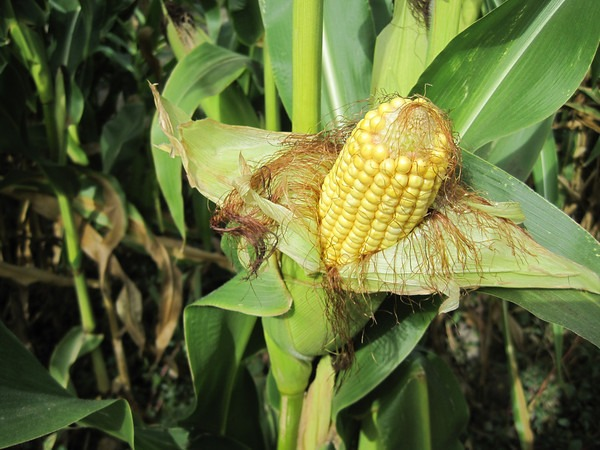
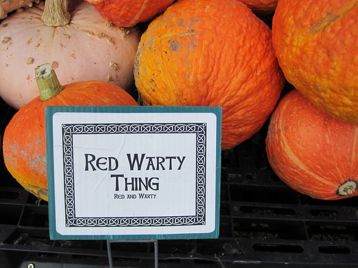
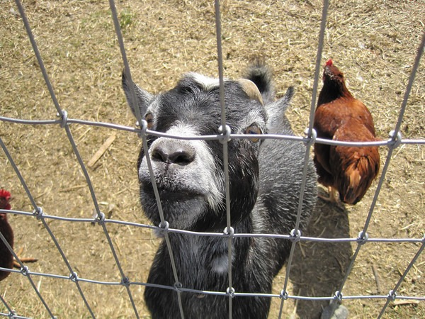

If my Seattle peeps need a fun way to spend an afternoon with the family, head out to Redmond and visit the South 47 Farm. They have crops you can pick, animals to pet and a huge corn maze. They actually carved up a full maze covering 5.5 acres in a corn field. The maze has shortcuts, clues, hidden signs and many dead ends. Good times!    

---

## Comments

### Nick
*October 2 at 2009 at 7:51 PM*

Could just be me, but the photos aren't showing up.

---

### MAS
*October 3 at 2009 at 12:05 AM*

Damn IE.  I don't know why Internet Explorer can't see SmugMug photos.  I had this same problem with my Vancouver posts.

---

### MAS
*October 3 at 2009 at 12:24 AM*

Fixed.  Looks like Smugmug won't allow me to embed an 600 pixel width image at 80% width.  I wish SmugMug had a 500 pixel width image like Flickr.  :(

---

### MAS
*October 6 at 2009 at 4:36 AM*

Smugmug has an external link setting that was turned to NO.  Fixed now.

---

### Jim
*October 26 at 2009 at 3:48 AM*

We actually went here today... the kids had fun ...probably would have been better in dry weather though!    :)

---

