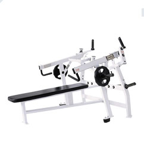

Of all the gym exercises, the bench press is the one that has been the most challenging. Tall ectomorphs have long arms and small wrists. Getting under a decent amount of weight and pushing it straight up is tough. Guys with impressive bench press numbers tend to be shorter and with thick wrists (endomorphs). Still, the bench press is somehow the gold standard of strength.

Because of the safety issues, getting really good at the bench press will require a spotter that you can trust. Anyone that has been reading this site knows that the _Glitterfication_ of gyms is making it harder and harder to find decent spotters. Add in the iPod Zombie effect and it becomes almost impossible to get a decent spot on a bench press at many gyms. And if you do get a spotter, they are either incompetent or bark at you like they were your drill sergeant. _Just spot me and be quiet._

Back in 2003, I got up to a _not-that-impressive_ 215 bench while weighing 210 (1.02 x BW). Then I had wrist surgery and didn't get full strength back until 2007 when I benched 225 while still weighing 210 (1.07 x BW). I've been stuck there ever since. **It just isn't safe to max out your bench press in a Glitter Gym.** Also, I vastly prefer the dumbbells on the incline bench over the barbell flat bench.

Then I got a 2-week trial pass at [my latest Glitter Gym](/2009/09/a-fresh-coat-of-glitter/) and spotted a piece of equipment that I have never seen before: The _Iso-Lateral Horizontal Bench Press by Hammer Strength_. Unlike the other plate-loading _Hammer Strength_ devices, this one is not done from a sitting position. It is a true flat bench. If you've never used _Hammer Strength_ equipment before, let me tell you that they come the closest to actual free weights. This machine has one edge over a barbell flat bench in that each arm is independent. The dominant arm can't compensate for the weaker one. The starting resistance is 18 pounds.

I love that I could just load up the plates and push without fear of having the weights collapse on my chest or neck. No spotter is needed. I was able to push up **3 solid reps of 238 pounds** while weighing 189 (1.26 x BW). I only have a few days left on my free pass and then I'm off to another Glitter Gym. I'm going to miss this piece of equipment.

I'm all for functional training and I'm not about to say a piece of equipment is better than free weights. However, safety should always come first. If you are tall and work out in a gym full of people you wouldn't trust to spot you, then be on the lookout for this equipment.

---

## Comments

### Mlis
*October 2 at 2009 at 6:06 PM*

That's very cool. I've never seen one before.

---

### Nick
*October 2 at 2009 at 7:47 PM*

Very True, and driven home recently by the recent injury to Stafon Johnson from USC.  Very sad.

http://latimesblogs.latimes.com/sports_blog/2009/09/usc-stafon-johnson-weightlifting-accident.html

---

### greg
*August 30 at 2015 at 10:10 PM*

Try dynamic set training , im 6'7 and i have had some very good gains with dumbells.

---

