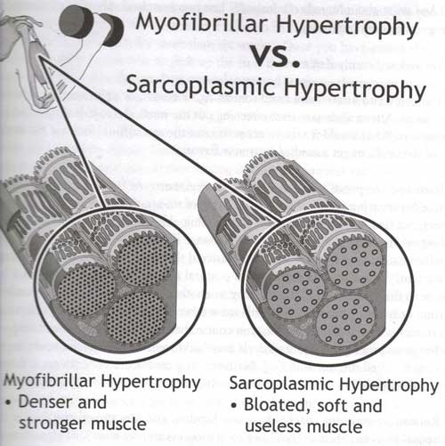

There have been several posts where I rail against high-repetition weight training, especially for women. When I tell people who are fearful of bulking up that they should lift heavier weights for few reps they look at me like I'm crazy. It is time to explore the two types of muscle growth. Note that I do not have a background in human physiology or related disciplines. My understanding of this concept started with the book _Power to the People!_ by Pavel Tsatsouline. I credit most of my strength gains over the past 8 years to the concepts I learned in this book.  _Power to the People! : Russian Strength Training Secrets for Every American by Pavel Tsatsouline_ The two types of muscle growth described in the book are **myofibrillar hypertrophy** and **sarcoplasmic hypertrophy**. What are the differences? Without going too deep into the science, myofibrillar is the denser muscle whereas sarcoplasmic is the bulkier muscle. As you can see in the image I scanned below, Pavel is a big proponent of myofibrillar hypertrophy  Many strength athletes will use a combination of both types of hypertrophy. Martial artists and non-heavy weight power-lifters will favor myofibrillar hypertrophy. Their goal is to pack as much strength into their muscles while keeping their weight down and without slowing the speed of their movements. Martial artist Bruce Lee once did [50 one-arm chin-ups](https://en.wikipedia.org/wiki/Bruce_Lee#Physical_feats). Bodybuilders and bouncers go for size. One of the goals of weight lifting is to fill out a shirt with muscle. _Pump you up!_ Sarcoplasmic hypertrophy does that. How does one favor myofibrillar hypertrophy?

-   Low repetition training (3-5 reps).
-   Heavyweights
-   Fewer sets
-   Compound movements that work multiple muscle groups.

How does one favor sarcoplasmic hypertrophy?

-   Medium to high repetition (8-15 reps)
-   Lighter weights
-   More sets
-   Use exercises that isolate muscle groups.

This post is just an introduction to these concepts and is not meant to be complete. Whenever someone tells me that they don't want to bulk up so they do lots of reps with light weights, I just shake my head in frustration. Now you know why. Stop training like a nightclub bouncer and start lifting like a martial artist. You ladies and seniors should especially pay attention to this post. You are ALL training wrong. Lifting pink-colored dumbbells for 15 reps is not making you stronger. And lifting heavy weights for fewer reps and sets will not bulk you up. **UPDATE June 2014:** I no longer believe Pavel was right in that one can preferentially train for myofibrillar or sarcoplasmic hypertrophy. See the article [Functional Hypertrophy - Fact vs Fiction](https://web.archive.org/web/20130425075441/http://jasonferruggia.com/functional-hypertrophy-fact-vs-fiction/). **December 2020:** I have no clue if Pavel was right or wrong. This debate continues with people smarter than me taking opposite sides.

---

## Comments

### chuck
*June 7 at 2011 at 8:04 PM*

good stuff...you are a wealth of knowledge and obviously well read.  gonna have to get pavel's book.  btw, i am blown away by bruce lee's 50 one arm chin ups.  i am no where near one.

---

### MAS
*June 7 at 2011 at 8:41 PM*

@Chuck - My opinions of Pavel keep evolving.  I respect him and his work, but I've come to realize that I never was his target audience.  For years I believed I was, but I wasn't.  I'm going to explain this in a future post.

---

### babak
*November 24 at 2011 at 2:24 PM*

thanks for good information and excellent book that you recommeded.My country Iran is in sanction and we can not buy the books if you have some interesting article about resistance training share it to me
thanks a million
babak from Iran

---

### George
*December 19 at 2011 at 3:51 PM*

Whilst it's true that bodybuilders go for size, to imply that they only aim to develop sarcoplasmic hypertrophy is misleading.

The goal, as you point out, is to maximise total muscle size. They have long realised that the best way to do this is by lifting to maximise both types of hypertrophy. That's why some of them can lift enormous amounts; you can't do that unless you're also pretty strong, and you only get strong by doing lower reps, with good rest periods and max or close to max weights. 

Just check out the vids on youtube of Ronnie Coleman deadlifting 800lbs, for singles and low reps, and actually with pretty good form (which is unusual for most bb'ers, if I'm going by the vids I've seen).

Just wanted to clear that up a little,
George Super BootCamps

---

