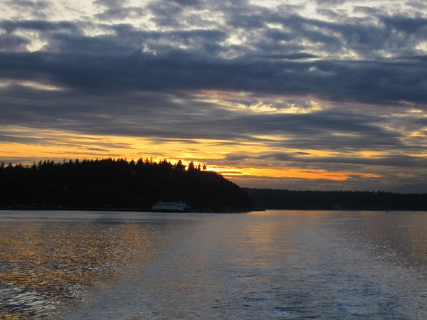
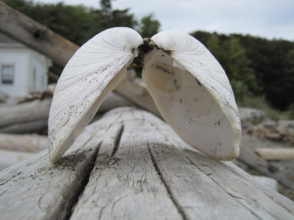

Yesterday was a great day to visit Vashon Island. Here are a few photos.

I did visit an interesting historical coffee site. Look for a post later this week on that.

---

## Comments

### Jenn
*October 12 at 2009 at 1:11 AM*

what beautiful pictures...  great shot with the shell...

---

### t.bone
*October 12 at 2009 at 5:01 PM*

what is that picture in middle?  Is it an animal or a plant?

---

### MAS
*October 12 at 2009 at 5:05 PM*

Jellyfish.  There were quite a few them.

---

