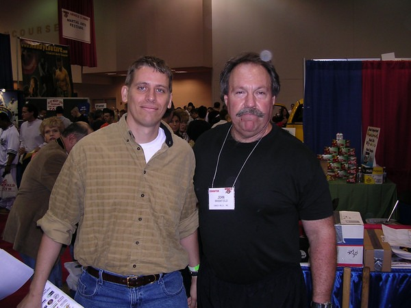

Today _T-Whatever_ released a new article titled [How Tall Guys Get Jacked](https://web.archive.org/web/20141019001138/http://www.t-nation.com/free_online_article/sports_body_training_performance/how_tall_guys_get_jacked) by Jimmy Smith. The article is full of tips to help us ectomorphs lift more weight in the gym. Some of the better tips include:

1.  "Keep the damn reps low" - AMEN!
2.  Play with half-reps.
3.  When doing bench presses, use a more narrow grip to avoid having your elbows flare out.

As good as the tips are, I feel the author missed the obvious one. What I have discovered in my 15 years of lifting is **the primary failure point to getting stronger is grip strength**. The tall lanky lifter has long arms and small wrists. Without a strong grip, the ectomorph will have major difficulty getting stronger.

Years ago I was fortunate to run across the company [IronMind](https://ironmind.com/). They specialize in grip strength and other strongman-like equipment. They have divided hand strength into 5 areas.

1.  Crushing grip - This is the classic handshake squeeze.
2.  Pinching grip - Thumb pressing strength.
3.  Open hand (supporting) - How strong is the hand without clenching?
4.  Extensors - How strong are the fingers when resistance prevents them from extending?
5.  Wrist strength - Strong wrists are critical to lifting heavy weights safely.

The most important two for us are **crushing grip** and **wrist strength**. For crushing grip, I highly recommend getting a Captains of Crush by Ironmind. The typical office hand gripper is only 25-35 pounds of pressure. Not enough to build any real hand strength. The Captains of Crush are for those that are serious about improving their grip strength.

\[table id=1 /\]

 Captains of Crush Hand Gripper - No. 1

I own the #1 and it took me almost a year before I could close it end-to-end in either hand. Soon I will be getting the #1.5. Only 5 people on the planet have ever closed the #4. In addition to the hand gripper, there are many ways to increase your hand strength. John Brookfield wrote two great books on the topic. I own them both.

 Mastery of Hand Strength, Revised Edition by John Brookfield

 The Grip Master's Manual by John Brookfield

I was also fortunate enough to meet John Brookfield at the Arnold Expo in 2004.

To build forearm and wrist strength, I highly recommend doing Farmers Walks. A Farmers Walk is when you grab a pair of heavy dumbbells and go for a walk. The heavier the dumbbell, the shorter the walk. Back in California, I used to put a 120-pound dumbbell in each hand and walk to the end of the driveway and back. I did that 10 times.

Personal trainers will tell you to wear gloves or use straps. Nonsense. Read John Brookfield. Get a Captains of Crush gripper and do Farmers Walks. In no time, you'll be benching more and doing weighted pull-ups.

---

## Comments

### Nick
*October 26 at 2009 at 9:38 PM*

If you upgrade to the 1.5, and want to sell the 1, let me know.  :-)

---

### chuck
*November 14 at 2011 at 9:46 PM*

Wow, I am amazed at what I keep finding on this blog.  I started with the trainer in July.  Soon after I got the #1.  I essentially use it throughout the day like working with my hands was part of my job (keyboard and phone work doesn't make for strong hands).  I estimate I do 15-20 small sets throughout the day but leave a little in the tank like Pavel told me.  I can do the #1 about 15 times.  I found a used #2 locally and am gonna buy it when I can get to the place.  When I started in the summer, my long term goal was the #2.  I have been amazed how quickly I progressed by using the very often.  I think the #3 could be a possibility in the long run.

---

### MAS
*November 14 at 2011 at 9:49 PM*

@Chuck - Glad to hear your success. I have a friend with a little too much confidence buy the #4. His hands are massive and he fires serious caliber weapons. He couldn't budge it with both hands.

---

### chuck
*November 14 at 2011 at 9:55 PM*

I happened to find a used #2 so I am gonna buy it and try to master it like I did the #1.  They also had a used #3 but I know I am WAY off from that so I won't even bother buying it.  The first 2 I got were just a start to build some minimal strength and toughness in my hands.  I imagine the #2 will kick my ass for a while.  I already tried it elsewhere and almost got it...probably half inch away.  1.5 was easy.  My hands are kinda small so the set is important.

---

### MAS
*November 14 at 2011 at 10:30 PM*

@Chuck - Good call getting the #2. I bought the #1.5 and closed it on the first attempt. Wishing I had got the #2 instead.

---

