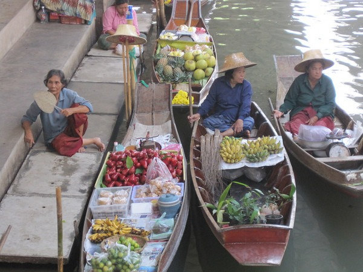

When it comes to face to face customer service, I use something I call the Paraguay / Circuit City scale. During my one day trip to Paraguay in 2006, I went to a market where the vendors were in your face trying to sell everything. It was the most relentless shopping experience ever. They made Tijuana look laid back. Then there was the late Circuit City. The employees never asked anyone if they could assist. Hell, they didn't even say hello. Circuit City employees worked at Circuit City so they could socialize with other Circuit City employees. Any interaction with the customer just interfered with that process. There is a happy medium. Up until visiting the Floating Market, Bangkok had been at that happy medium. Then they went all Paraguay on me. To see the Floating Market we signed up for a tour. We were driven an hour out of Bangkok.Once there we took a nice boat ride to the market. At that point they tried to upsell us boating THROUGH the market. A bit dishonest from the tour company, since we paid to tour the Floating Market from the boat, not the ride to the Floating Market. We didn't pay.  Once off ther boat the vendors descended on us like mosquitos. This was all tourists being lead into a trap. One lady stuck a stick with fruit inches from eye after I declined her offer for a free sample. Eventually we found a place to wait out our time there and not be hassled. We got some great photos and visited a wood carving place on the way back.  I am sure there is some traditional Floating Market somewhere on the planet. Avoid the one outside Bangkok.