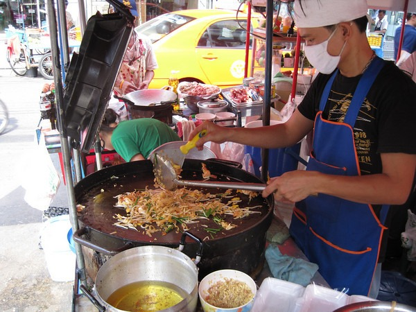

How about 5 nights then? I was told by several people who had visited to Thailand to get out of Bangkok as soon as possible. It is dirty, loud and not representative of the _real_ Thailand. I had low expectations for Bangkok. The only reason I scheduled 5 nights there was so I could meet up with 2 friends. My verdict is that I liked my time in Bangkok. I arrived in the city doing absolutely no preparation. No map, no travel book, nothing. I didn't even read the page on the Wikipedia. As much as I like to travel, I dislike travel planning. For Bangkok I did the random Urban Hike. I walked everywhere. Unlike my trip to Brazil and Paraguay, I never once felt like I was a target for a crime. The air quality is pretty bad, but not as bad as Sao Paulo or Rio de Janiero. But by the second day I was sneezing up a storm, almost like I was having a pollen allergy attack. Anthony Bourdain, the host of TV's _No Reservations_, really has inspired me to embrace local cuisine. In Bangkok there are street carts of food EVERYWHERE. It is good and dirt cheap.  The biggest falsehood that I was told about Thailand was that everyone speaks English and that all the menus are in English. Not true for Bangkok. Not even close. When I took to the streets exploring areas and eating food in areas away from the other tourists almost nobody spoke a word of English. How did I eat? I walked up to a cart and saw something another customer ordered and I pointed at it and then paid. What else needs to be said? My favorite cart had a few tables and seats. It was just a block away from my hotel. A full plate of food for 40 baht. That is about$1.20. Super tasty. Stick meat was even cheaper at 10 baht (35 cents). Oh yeah, Bangkok also has some temples. Yawn. I came for the food. 

---

## Comments

### TigerAl
*November 21 at 2009 at 6:45 PM*

I'm so jealous right now, MAS.. the food looks awesome (stick meat and all .. you only live once, right? :) )!

---

### Rachel
*November 21 at 2009 at 7:26 PM*

Kudos for your adventurous eating spirit!

---

### Jenn
*November 21 at 2009 at 8:50 PM*

now THATS my kind of travel... except I DO like the planning part... . the anticipation, it's kinda like travel foreplay :-)  looks like an awesome trip.  Great pics...  I'm envious! haven't been out of the country in ages.

---

### aviva
*November 23 at 2009 at 11:17 PM*

i'd move to Thailand tomorrow on the food alone. 
as for that falsehood, I could be to blame - but in my defense, we spent two days in Bangkok in a Marriott Resort &amp; Spa and had a tour guide. The majority of time was in Chiang Mai flying by the seat of our pants; I think you'll agree that it was a LOT different up there. I'm so jealous....

---

