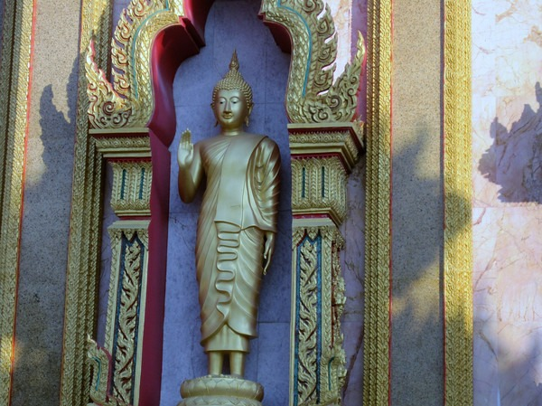
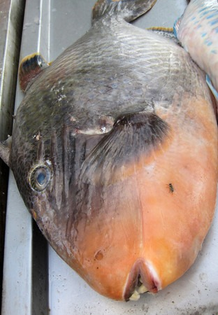

The prime vacation destination for Thailand is probably Phuket. That should have been a warning. I did not care for Phuket. It was loud and the vendors were beyond obnoxious. It was probably my mistake for staying at Patong Beach. Once I got away from Patong, the rest of Phuket was much better. **Patong is the Daytona Beach of Thailand.**

The highlight of mystay in Phuket was hiring a taxi to drive mearound the island to take photos, see stuff and do a little hiking. If you plan to visit Thailand, you can avoid Phuket. There are better places to have the Thailand beach experience.

[Photo Gallery for Phuket, Thailand](https://www.flickr.com/photos/129592470@N02/sets/72157650152144795/)

---

## Comments

### Jamie
*November 29 at 2009 at 8:52 AM*

"Once I got away from Patong, the rest of the Phuket was much better"

Bingo! I hae been in Phuket for 10 years and very rarely go to Patong unless I have to. Phuket is a big place, there are many beautiful spots. Glad you found some!

Jamie
Phuket

---

### Charlie
*November 30 at 2009 at 5:46 AM*

Couldn't agree more with you. If you are 18 and looking for one big party then Patong is just the ticket. However like you say there is so much more to Phuket and "proper" Thailand is accessible with a fairly short drive.
Great pics by the way.

---

