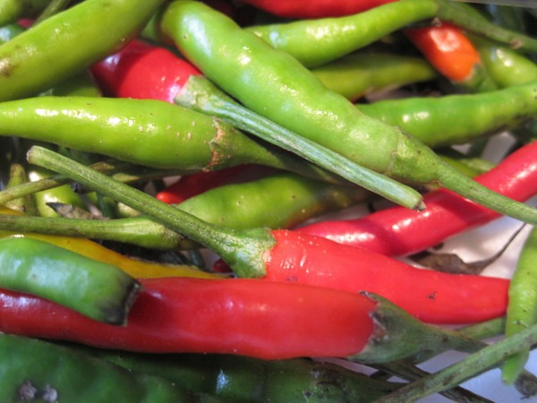

Yesterday I made the following dish for lunch.

-   Broiled Wild Salmon with a mayo seal.
-   Fresh cut green beans cooked with onions, garlic and hot peppers in [tallow](/2011/02/rendering-beef-tallow-in-a-crock-pot/) rendered from a grass-fed cow.

The dish was excellent and easy to make.    While eating my lunch, I thought about what I would be eating if I was still a kid back in middle school. Thanks to the Internet, I was able to easily locate the lunch menu for [Woodward Park Middle School](http://www.columbus.k12.oh.us/index.html) in Columbus, Ohio. The nutritional quality of the menu was appalling. The lunch menu was broken down into 6 _Zones_, each one designed with an "_extreme_" font. Here was the menu for November 6, 2009. I would link to it directly, but their idiot web designer uses PDFs inside embedded frames. You'd think that a public school system that has special needs students would design their website to be [508 compliant](https://www.section508.gov/). Nope. But I'm getting my rant off subject. Back to the menu.

1.  Burger Zone - Cheeseburger, Chicken Sandwich, Oven Fries
2.  Energy Zone - Fish & Chips
3.  Pizza Zone - Specialty Pizza
4.  Market Zone - Combo Sub w/Chips, Chef Salad
5.  Energy Zone\* - Enchilada
6.  Sides Zone - Selection of Fruits & Vegetables, Skim milk, 1% low fat milk, 1% chocolate milk, juice

This is the crap kids are eating today. A bunch of low quality protein surrounded with unnecessary carbohydrates. No wonder children are getting so fat these days. Even the choice of low fat milk is wrong. Columbus City Schools and I'm sure most parents missed the memo that kids who drink [whole fat milk are leaner](https://www.sciencedaily.com/releases/2009/11/091103102347.htm). I may not know the first thing about raising a child, but I do know that what I see most parents feeding their offspring is borderline child abuse. Human children somehow evolved 2.5 million years without french fries and macaroni. Take away the sugar and empty carbohydrates. They'll be fine. Most people would consider my lunch to be more nutritious than anything offered by the 6 Zones. **By calories my lunch was probably 50% fat.** Since I dropped the bread, pasta, white potatoes and most rice, I've gotten much leaner and my thinking is clearer. _\* I guess they couldn't come up a fresh name for Zone 5, so they repeated the name of Zone 2_

---

## Comments

### TigerAl
*November 8 at 2009 at 8:43 PM*

Unfortunately, the school cafeterias have to cater to the kids' preferences and they do the best they can from a nutrition standpoint.  You are absolutely right about it being the fault of parents today.. way too many Happy Meal type choices because they are busy working long hours and don't bother with home cooked meals and teaching kids about good nutrition and healthy choices (they probably don't know very much about this anyway).

And don't even get me started on the subject of parents letting kids watch DVDs in the family mini-van because they don't want to deal with their antics ... Happy Meals and TV generation, nice!

---

### MAS
*November 9 at 2009 at 6:57 PM*

@TigerAl - I am very reluctant to critique parents on most things, since I've never "walked a mile in their shoes", but nutrition is one thing I wouldn't budge on.

---

