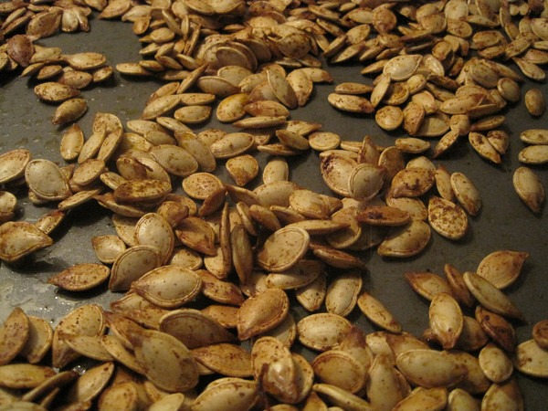

On Sunday a local grocery store was giving away free pumpkins. Since I like pumpkins and I love free, I grabbed one. It should be noted that I've never cut into a pumpkin. It is about time I did. My plans for the pumpkin were for 4 dishes.

1.  Roasted pumpkin cubes bathed in brown sugar and cinnamon.
2.  Pumpkin puree for protein shakes and for added flavor to plain yogurt.
3.  Roasted Pumpkin seeds
4.  Pumpkin curry.

Dish #1 went pretty well considering I did not use a recipe. I just winged it. I will improve on it tonight.

Dish #2 was also a success. Not as thick as canned pumpkin. It is probably more like pumpkin baby food, which works well in shakes.

Dish #3 tastes great, but I may have put too much butter on them. _Is too much butter possible?_ I added some Cajun spices.

Dish #4 is tomorrow. I have no doubt it will taste great, as I've cooked squash in many past curries.

If I would have known how much food a single pumpkin could yield, I would have been cooking with them a lot sooner.

---

## Comments

### Paul
*November 4 at 2009 at 3:42 AM*

Well I love to carve the pumpkins, never really knew what to do with them besides pie. Pie is all well and good i just don't have a huge sweet tooth. 

I did however harvest a ton of pumpkin seeds I love to snack on them. Can't wait to see how your other dishes turn out.

---

### TigerAl
*November 4 at 2009 at 3:59 AM*

Try this old favorite of mine with pumpkin cubes:

Heat 1-2 tbsp of oil in a pan, add half a tsp of black mustard seeds, 4-5 curry leaves (from an Indian store), a tsp of crushed red pepper and 1/4 cup of coconut (from the baking aisle at the grocery store).  Fry the mixture for a few mins then add 3-4 cups of raw pumpkin cubes and salt to taste.  Cover and cook until the pumpkin is soft.  

Yummy! :)

---

### TigerAl
*November 4 at 2009 at 4:04 AM*

Forgot to mention that you should fry the ingredients as well as cover and cook on low heat.  The former is because the red pepper gives off vapors that are seriously pungent and the latter because the pumpkin might get burnt on high heat (add a little water while cooking if needed).

---

